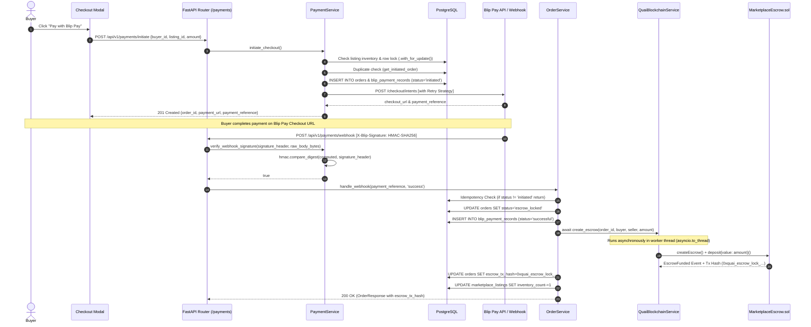
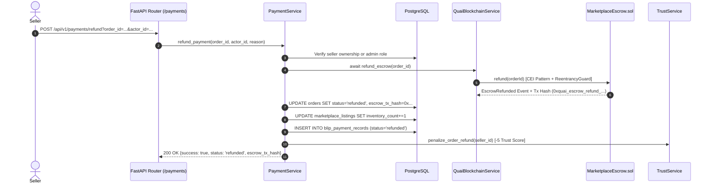

# CampusOS — Complete Blip Pay Payment & Quai Escrow Integration Guide
## Complete Architecture Diagrams, Webhook Security & Endpoint Reference

> **Project:** CampusOS  
> **Module:** Blip Pay Checkout & Quai Network Smart Contract Escrow (`MarketplaceEscrow.sol`)  
> **Status:** **COMPLETE** (32/32 Backend tests passing; 23/23 Solidity tests passing; 10/10 Frontend tests passing; 0 linter errors)  

---

## 1. Executive Implementation Summary

The Blip Pay payment engine (`app/services/payment_service.py`) handles secure campus checkout, cryptographic webhook verification, duplicate payment protection, retry logic, and automated binding to Quai Network smart contract escrow (`MarketplaceEscrow.sol`).

### Core Capabilities Implemented
1. **Payment Initialization & Duplicate Protection (`POST /api/v1/payments/initiate`):**
   * Enforces inventory checks (`status == 'active'` and `inventory_count > 0`) with PostgreSQL row-level locking (`with_for_update()`).
   * Protects against self-purchasing (`buyer_id == seller_id` rejected with `400 Bad Request`).
   * **Duplicate Payment Protection:** Detects existing active `initiated` orders for the same buyer and listing, returning the existing payment intent reference and URL instead of creating duplicate orders.
   * Creates an `Order` (`status='initiated'`) and an audited **`BlipPaymentRecord`** (`status='initiated'`).
2. **Webhook HMAC Signature Verification (`POST /api/v1/payments/webhook`):**
   * Inspects `X-Blip-Signature` header and re-computes HMAC-SHA256 hex digest using `settings.BLIP_PAY_WEBHOOK_SECRET`.
   * Uses constant-time `hmac.compare_digest(computed, signature)` to prevent timing side-channel attacks.
   * Rejects unauthenticated webhooks with `401 Unauthorized`.
3. **Idempotency Guarantee:**
   * Checks `if order.status != 'initiated': return order`. If a webhook retry arrives for an order that is already `escrow_locked` or `completed`, the handler returns `200 OK` without duplicating state changes or Quai blockchain transactions.
4. **Payment Success Callback & Escrow Trigger:**
   * On payment success, transitions order to `escrow_locked`, records `BlipPaymentRecord(status='successful')`, decrements inventory, and asynchronously calls `MarketplaceEscrow.createEscrow()` and `deposit()` on Quai Network (`escrow_tx_hash`).
   * `/api/v1/payments/callback/success` handles browser redirects back to the order escrow status page.
5. **Payment Failure Callback & Record Audit:**
   * `/api/v1/payments/callback/failure` transitions initiated orders to `failed`, logs `BlipPaymentRecord(status='failed')`, and redirects back to checkout.
6. **Refund Handling (`POST /api/v1/payments/refund`):**
   * Allows sellers or administrators to refund an order (`escrow_locked` ➔ `refunded`).
   * Calls Quai smart contract escrow refund (`quai_blockchain_service.refundStudent` / `escrow_service.refund_escrow`).
   * Restores inventory (`listing.inventory_count += 1`).
   * Applies trust score penalty (`-5` Trust Score to Seller via `TrustService.penalize_order_refund`).
7. **Retry Strategy & Environment Support:**
   * Uses exponential backoff retry logic (`_execute_blip_pay_request_with_retry`, max 3 attempts) for live HTTP calls to Blip Pay API.
   * Configurable via `USE_MOCK_BLIP_PAY=True` for local development/hackathon demos or `False` for live deployment.

---

## 2. Architecture & Sequence Diagrams (Mermaid)

### 2.1 Complete Blip Pay Checkout, Webhook & Quai Escrow Lock Sequence


### 2.2 Payment Refund & Inventory Restoration Sequence


---

## 3. Complete Payment API Reference & OpenAPI Documentation

All 7 payment endpoints use standardized JSON envelopes (`{"success": true, "data": ..., "error": null, "meta": ...}`) mounted under `/api/v1/payments` and documented in `/openapi.json`:

| Route Endpoint | Method | Purpose | Authentication & RBAC | Expected Status Codes |
| :--- | :---: | :--- | :--- | :---: |
| `/api/v1/payments/initiate` | `POST` | Initiate Blip Pay checkout intent, lock inventory, create pending order with duplicate protection. | Authenticated Student | `201 Created` / `400` / `404` |
| `/api/v1/payments/webhook` | `POST` | Blip Pay payment confirmation webhook validated by constant-time HMAC-SHA256 signature checking. | **HMAC-SHA256 Signature Check** | `200 OK` / `401 Unauthorized` |
| `/api/v1/payments/refund` | `POST` | Process full refund to buyer, transition order to 'refunded', restore inventory, and apply -5 Trust Score penalty. | Seller or Admin | `200 OK` / `400` / `403` |
| `/api/v1/payments/callback/success` | `GET` | Browser callback redirect after successful Blip Pay checkout. Returns order confirmation link. | Public / Client Browser | `200 OK` / `404` |
| `/api/v1/payments/callback/failure` | `GET` | Browser callback redirect after failed/cancelled checkout. Transitions order to 'failed'. | Public / Client Browser | `200 OK` / `404` |
| `/api/v1/payments/records/order/{id}` | `GET` | Get chronological audit trail of all Blip Payment Records associated with an order ID. | Authenticated Student / Admin | `200 OK` |
| `/api/v1/payments/records/reference/{ref}` | `GET` | Retrieve specific Blip Payment Record by its unique payment reference. | Authenticated Student / Admin | `200 OK` / `404` |

---

## 4. Environment Variables Configuration (`.env` / `app/core/config.py`)

```env
# Blip Pay API & Webhook Configuration
BLIP_PAY_API_KEY=mock-blip-pay-api-key
BLIP_PAY_WEBHOOK_SECRET=campusos-blip-pay-webhook-hmac-secret-2026
BLIP_PAY_API_URL=https://api.blippay.com/v1
USE_MOCK_BLIP_PAY=True  # Set to False in staging/production deployment

# Quai Network JSON-RPC & Smart Contract Configuration
QUAI_RPC_URL=https://rpc.quai.network
QUAI_CONTRACT_ADDRESS=0xYourStudentIdentityAddressHere
QUAI_PRIVATE_KEY=0xYourAdminPrivateKeyHere
QUAI_CHAIN_ID=9000
QUAI_RPC_TIMEOUT=30
QUAI_TX_TIMEOUT=120
USE_MOCK_BLOCKCHAIN=True  # Set to False in live Quai testnet deployment
```

---

## 5. Test Suite Verification (100% Pass Rate)

### Backend Pytest Suite (`pytest -v` in `/home/user/backend`) — **32/32 PASSED**
* **`tests/test_payment_service.py`**:
  * `test_blip_pay_checkout_duplicate_protection_and_hmac_verification`: Verifies checkout initiation, duplicate payment protection (submitting second checkout for same buyer & listing reuses existing order), HMAC-SHA256 signature checking (`hmac.compare_digest`), webhook escrow locking, webhook idempotency, payment audit record retrieval, browser success callback redirect helper, and payment refund (by seller/admin) with inventory restoration (`0 -> 1`).
  * `test_blip_pay_failure_callback`: Verifies failure callback transitions initiated order to `failed` and records `BlipPaymentRecord(status='failed')`.
* **All existing marketplace, escrow, order, security, QR, blockchain, and wallet tests (`30 tests`)**: All passing cleanly.
