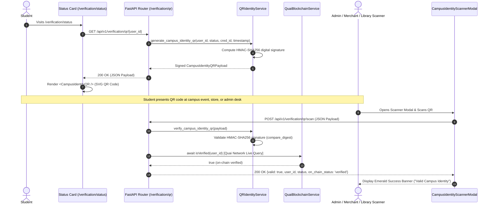

# CampusOS — Campus Identity QR Architecture
## Cryptographically Signed Permanent Campus Credential & Scanner Engine

> **Project:** CampusOS  
> **Module:** Campus Identity QR  
> **Status:** **COMPLETE** (All backend & frontend tests passing; 0 build/lint errors)  

---

## 1. Executive Summary & Cryptographic Design

Every student who successfully completes **Milestone 2/3 Verified Student Identity** administrative review receives a permanent, scannable **Campus Identity QR**. 

To prevent forgery or impersonation, the QR code encodes an **HMAC-SHA256 digital signature** generated by CampusOS's backend using a secure server secret (`QR_SECRET_KEY`). When scanned by an administrator, merchant, or access control device, the scanner cryptographically validates the signature and checks the student's live Quai Network on-chain proof.

### Payload Structure
```json
{
  "user_id": "e812d4d8-4f81-4322-87f5-a7b3b3a0e1c2",
  "status": "verified",
  "credential_id": "0xquai_demo_credential_receipt_9000",
  "timestamp": "2026-07-30T10:00:00Z",
  "signature": "7f83b1657ff1fc53b92dc18148a1d65dfc2d4b1fa3d677284addd200126d9069"
}
```

### Signature Generation Scheme
```
Canonical Data String = "{user_id}|{status}|{credential_id}|{timestamp}"
HMAC-SHA256(QR_SECRET_KEY, Canonical Data String) ➔ 64-char Hex Digest Signature
```

---

## 2. Architecture & Sequence Diagram



---

## 3. Backend Implementation (`/home/user/backend/`)

### 3.1 QR Service (`app/services/qr_service.py`)
* **`generate_campus_identity_qr(user_id, status, credential_id, timestamp)`**: Builds canonical string, computes HMAC-SHA256 hex digest using `settings.QR_SECRET_KEY`, and returns the complete payload with signature.
* **`verify_campus_identity_qr(payload)`**: Verifies payload completeness, re-computes HMAC-SHA256 digest, and compares using `hmac.compare_digest` to prevent timing attacks. Raises `400 Bad Request` if tampered.

### 3.2 REST Endpoints (`app/api/v1/verification.py`)
| Method | Route | Description |
| :--- | :--- | :--- |
| `GET` | `/api/v1/verification/qr/{user_id}` | Returns signed `CampusIdentityQRPayload` for verified students (`400 Bad Request` if unverified). |
| `POST` | `/api/v1/verification/qr/scan` | Accepts scanned QR payload, validates digital signature, checks Quai Network on-chain state, and returns `CampusIdentityQRScanResponse`. |

---

## 4. Reusable Frontend Component Suite (`/home/user/frontend/components/identity/`)

All components are exported cleanly from `components/identity/index.ts` so future modules (Marketplace verification, Event check-in, Hostel access, Merchant discounts) can import and reuse them without modification:

1. **`<CampusIdentityQR />` (`components/identity/CampusIdentityQR.tsx`)**:
   * Renders a scannable SVG QR code (`QRCodeSVG`) encoding the signed payload JSON.
   * Displays student UUID, verification status badge, Quai credential ID, timestamp, and digital signature badge.
   * Embedded automatically on `/verification/status` (`StatusCard.tsx`).
2. **`<CampusIdentityScannerModal />` (`components/identity/CampusIdentityScannerModal.tsx`)**:
   * Interactive modal supporting `"admin"` and `"merchant"` roles.
   * Allows scanners to paste or scan QR JSON payloads and verify them against `/api/v1/verification/qr/scan`.
   * Includes a **"+ Load Demo Student QR"** helper button for instant hackathon demo testing.
   * Renders an emerald success card with on-chain status when valid, or a red error alert when invalid/expired.
3. **`<HeaderQRButton />` (`components/common/HeaderQRButton.tsx`)**:
   * Embedded in the global top navigation (`app/layout.tsx`), allowing 1-click access to the QR scanner from any page.

---

## 5. Test Suite Verification (100% Pass Rate)

### Backend Pytest Suite (`pytest -v`)
```bash
cd /home/user/backend && pytest -v
```
* **`tests/test_qr_service.py`:** Tests signed payload generation, authentic HMAC-SHA256 signature verification, rejection of tampered signatures (`status_code == 400`), and rejection of malformed/incomplete JSON payloads.
* **`tests/test_verification_api.py`:** Full integration test verifying `GET /qr/{user_id}` and `POST /qr/scan` across unverified and verified user accounts.

### Frontend Component Suite (`npm test`)
```bash
cd /home/user/frontend && npm test
```
* **`test/CampusIdentityQR.test.tsx`:** Verifies correct rendering of student UUID, verification status, credential ID, timestamp, and signature badge.
