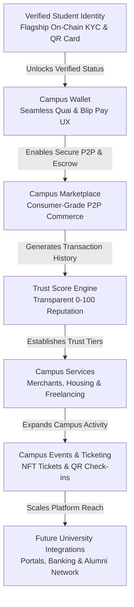

# CampusOS — Engineering Handbook & Implementation Roadmap
## The Trusted Digital Operating System for African Universities

> **Project:** CampusOS  
> **Buildathon Target:** Quai × Blip Buildathon (Hackathon MVP & Production Roadmap)  
> **Architecture Style:** Modular Monolith with Microservice-Ready Domain Separation  
> **Rule:** Architecture Enhancement & Roadmap Refactor — **No Implementation Code Generated**  

---

## Table of Contents
1. [Platform Vision & Module Relationship](#1-platform-vision--module-relationship)
2. [Document 1: Updated Implementation Roadmap (Milestones 1–8)](#2-document-1-updated-implementation-roadmap)
3. [Document 2: Engineering Specification](#3-document-2-engineering-specification)
4. [Document 3: Development Standards Guide](#4-document-3-development-standards-guide)
5. [Document 4: Folder Structure Documentation](#5-document-4-folder-structure-documentation)
6. [Document 5: API Design Standards](#6-document-5-api-design-standards)
7. [Document 6: Database Standards](#7-document-6-database-standards)
8. [Document 7: Smart Contract Integration Standards](#8-document-7-smart-contract-integration-standards)
9. [Document 8: UI Component Standards](#9-document-8-ui-component-standards)
10. [Document 9: Git Workflow Guide](#10-document-9-git-workflow-guide)
11. [Document 10: Milestone Completion Checklist](#11-document-10-milestone-completion-checklist)
12. [Document 11: QA Checklist](#12-document-11-qa-checklist)
13. [Document 12: Deployment Checklist](#13-document-12-deployment-checklist)
14. [Document 13: Demo Readiness Checklist](#14-document-13-demo-readiness-checklist)
15. [Document 14: Judge Evaluation Checklist](#15-document-14-judge-evaluation-checklist)
16. [Document 15: Technical Debt Log Template](#16-document-15-technical-debt-log-template)
17. [Document 16: Risk Register](#17-document-16-risk-register)
18. [Document 17: Architecture Decision Records (ADRs)](#18-document-17-architecture-decision-records-adrs)

---

## 1. Platform Vision & Module Relationship

### 1.1 The Vision
**CampusOS** is **"The trusted digital operating system for African universities."**  

Unlike traditional payment apps or student forums that focus purely on isolated transactions, CampusOS establishes a **persistent, portable trust layer** across every dimension of campus life. Every payment, marketplace trade, peer review, and event registration contributes to a student's verifiable **Trust Score**, creating a scam-free campus economy powered by **Quai Network** (blockchain verification & escrow) and **Blip Pay** (secure campus payments).

### 1.2 Architectural Module Relationship Flow
Every module in CampusOS builds progressively toward a unified campus operating system. The lifecycle is designed so that foundational trust enables seamless financial and commercial interactions:



---

## 2. Document 1: Updated Implementation Roadmap

Each milestone in this refactored roadmap is **independently testable, results in a deployable working demo, and adheres to strict software engineering standards**.

### 2.1 Milestone Deliverable Standard (Mandatory 9-Point Checklist)
Every milestone below **MUST** conclude with the following 9 verified artifacts before advancing:
1. [x] **Working Frontend:** Deployed and accessible on Vercel preview URL.
2. [x] **Working Backend:** Deployed and accessible on Railway preview URL.
3. [x] **Database Migration:** Alembic migration scripts tested (`upgrade head` / `downgrade -1`).
4. [x] **API Documentation:** Interactive OpenAPI/Swagger spec live at `/docs`.
5. [x] **Unit Tests:** Pytest (backend) and Jest/Vitest (frontend) suites passing with >85% coverage.
6. [x] **Integration Tests:** End-to-end API lifecycle and UI component tests passing.
7. [x] **Manual Testing Checklist:** Role-based walkthrough completed across devices.
8. [x] **Git Checkpoint:** Tagged release branch (`v0.X.0-milestone-X`) merged via Pull Request.
9. [x] **Demo Checklist:** Curated sample data and script ready for judges.

---

### Milestone 1: Project Scaffolding, Core Infrastructure & Engineering Baseline
* **Goal:** Initialize the Modular Monolith structure for Next.js 15 (App Router) and FastAPI, configure PostgreSQL with SQLAlchemy 2.0 ORM and Alembic, establish Quai Network SDK testnet connectivity, and implement core middleware (error handling, structured logging, CORS, rate limiting).
* **Estimated Files:**
  * `frontend/app/layout.tsx`, `frontend/middleware.ts`, `frontend/services/apiClient.ts`, `frontend/types/common.ts`, `frontend/utils/config.ts`
  * `backend/app/main.py`, `backend/app/core/config.py`, `backend/app/core/database.py`, `backend/app/core/security.py`, `backend/app/middleware/exception_handler.py`, `backend/app/middleware/logger.py`, `backend/app/middleware/rate_limit.py`
  * `backend/alembic.ini`, `backend/alembic/env.py`, `backend/alembic/versions/0001_initial_base.py`
* **Database Changes:** Configure PostgreSQL connection pooling (Supabase/Neon). Setup SQLAlchemy declarative base with UTC timestamp and UUID primary key mixins.
* **APIs:** 
  * `GET /health` — Returns system status, database latency, and Quai RPC node readiness.
* **UI Components:**
  * `RootLayout` — Global layout with theme and font styling.
  * `Navbar` & `Footer` — Common navigation header and footer shell.
  * `ToastProvider` — shadcn/ui global notification wrapper.
  * `ErrorBoundary` — Application-wide crash fallback display.
* **Smart Contracts:** Hardhat / Foundry development workspace configured for Quai Network testnet.
* **Milestone 1 Testing:**
  * Backend health probe & configuration unit test (`test_health.py`).
  * DB session transactional lifecycle & rollback test (`test_database.py`).
  * Frontend root layout mount & API client latency smoke test.

---

### Milestone 2: Authentication, Clerk/JWT Integration & RBAC Core
* **Goal:** Implement seamless user onboarding supporting modern authentication (Clerk / JWT compatibility), Role-Based Access Control (Student, Merchant, Admin), password reset flows, and user profile management.
* **Estimated Files:**
  * `backend/app/models/user.py`
  * `backend/app/schemas/auth.py`, `backend/app/schemas/user.py`
  * `backend/app/api/auth.py`, `backend/app/api/users.py`
  * `backend/app/services/auth_service.py`, `backend/app/services/user_service.py`
  * `backend/app/middleware/auth_middleware.py`
  * `frontend/app/(auth)/login/page.tsx`, `frontend/app/(auth)/register/page.tsx`, `frontend/app/(dashboard)/profile/page.tsx`
  * `frontend/services/authService.ts`, `frontend/store/authStore.ts`, `frontend/components/common/AuthGuard.tsx`
* **Database Changes:**
  * Create **`Users`** table: `id` (PK, UUID), `name` (String), `email` (String, Unique), `wallet_address` (String, Nullable/Unique), `student_id` (String, Nullable), `school` (String), `faculty` (String), `department` (String), `level` (String), `trust_score` (Integer, Default: `50`), `verification_status` (Enum: `pending`, `verified`, `rejected`, Default: `pending`), `role` (Enum: `student`, `merchant`, `admin`, Default: `student`), `created_at` (Timestamp).
* **APIs:**
  * `POST /auth/register` — Register student or merchant account.
  * `POST /auth/login` — Authenticate and issue signed JWT / session token.
  * `POST /auth/logout` — Invalidate user session.
  * `GET /auth/profile` — Retrieve current authenticated profile and trust status.
  * `PUT /auth/profile` — Update editable profile fields.
* **UI Components:**
  * `LoginForm` & `RegisterForm` — Zod-validated authentication modals.
  * `ProfileHeader` & `ProfileForm` — Editable profile view with role badge display.
  * `RoleBadge` — Component displaying Student, Merchant, or Admin status.
  * `AuthGuard` — HOC/Wrapper protecting authenticated routes.
* **Smart Contracts:** None in this milestone.
* **Milestone 2 Testing:**
  * JWT generation, validation, and expiration unit tests (`test_auth_service.py`).
  * E2E API tests for register, login, profile fetch, and profile edit (`test_auth_api.py`).
  * RBAC middleware tests verifying forbidden access when roles mismatch.

---

### Milestone 3: Flagship Verified Student Identity & Reusable Campus Identity QR (`StudentIdentity` Contract)
* **Goal:** Deliver the flagship Verified Student Identity module. Enable multi-document upload (Student ID, Admission Letter), university email verification (.edu.ng / institutional domain), an administrative review queue, SHA-256 cryptographic credential hashing, Quai Network on-chain registration, credential revocation/re-verification, and generation of a reusable **QR Campus Identity Card**.
* **Estimated Files:**
  * `backend/app/models/verification.py`, `backend/app/models/audit_log.py`
  * `backend/app/schemas/verification.py`
  * `backend/app/api/verification.py`
  * `backend/app/services/verification_service.py`, `backend/app/services/qr_service.py`
  * `backend/app/contracts/student_identity.py`
  * `frontend/app/(dashboard)/verification/page.tsx`, `frontend/app/(dashboard)/identity-card/page.tsx`
  * `frontend/components/verification/UploadForm.tsx`, `frontend/components/verification/StatusStepper.tsx`
  * `frontend/components/identity/QRIdentityCard.tsx`, `frontend/components/identity/CredentialModal.tsx`
  * `frontend/components/common/VerifiedBadge.tsx`
* **Database Changes:**
  * Create **`Verification`** table: `id` (PK, UUID), `user_id` (FK to Users.id), `student_id_document` (String Cloudinary URL), `admission_letter` (String Cloudinary URL), `university_email` (String, Nullable), `email_verified` (Boolean, Default: `False`), `status` (Enum: `pending`, `approved`, `rejected`, `revoked`), `approved_by` (FK to Users.id, Nullable), `credential_hash` (String, SHA-256 Hex), `approved_at` (Timestamp, Nullable), `rejection_reason` (Text, Nullable).
  * Create **`VerificationAudit`** table: `id` (PK, UUID), `verification_id` (FK), `old_status` (String), `new_status` (String), `changed_by` (FK to Users.id), `timestamp` (Timestamp).
* **APIs:**
  * `POST /verification/upload` — Submit verification documents and institutional email.
  * `GET /verification/status` — Fetch verification status, audit history, and credential hash.
  * `POST /verification/approve` — Admin endpoint: approve student, write hash to Quai contract, award `+10` Trust Score, and activate Verified Badge.
  * `POST /verification/reject` — Admin endpoint: reject verification with reason.
  * `POST /verification/revoke` — Admin endpoint: revoke credential on-chain and deduct Trust Score.
  * `GET /verification/card/{user_id}` — Public verification endpoint: validates cryptographic proof and returns QR Campus Identity status.
* **UI Components:**
  * `UploadForm` — Document uploader with Cloudinary progress indicator.
  * `StatusStepper` — Visual stepper showing: Documents Submitted ➔ Admin Under Review ➔ On-Chain Registration ➔ Verified.
  * `QRIdentityCard` — Reusable digital campus ID card displaying student photo, name, department, Verified Badge, and scannable QR code.
  * `CredentialModal` — Shows SHA-256 hash, Quai transaction receipt, and verification history.
  * `VerifiedBadge` — Universal SVG badge displayed next to verified usernames across the platform.
* **Smart Contracts:**
  * **`StudentIdentity` Contract (Quai Network):**
    * Functions: `registerStudent(address user, bytes32 credHash)`, `verifyStudent(address user)`, `revokeStudent(address user)`, `isVerified(address user)`, `getCredentialHash(address user)`.
* **Milestone 3 Testing:**
  * SHA-256 document hashing & email domain validation unit tests (`test_verification_service.py`).
  * Smart contract unit tests on local Hardhat/Foundry network (`test_student_identity.sol`).
  * E2E test: Student upload ➔ Admin approve ➔ Quai hash recorded ➔ QR card live ➔ Trust Score increased by `+10`.

---

### Milestone 4: Seamless Campus Wallet & QR P2P Payments (`ReceiptRegistry` Contract)
* **Goal:** Provide a frictionless, consumer-app wallet experience. Hide complex blockchain terminology behind simple UI actions (`Connect Wallet` ➔ `Ready`). Enable native Quai balance lookups, paginated transaction histories, and instant QR-code-based peer-to-peer (P2P) campus payments backed by immutable on-chain receipt logging via the **`ReceiptRegistry`** contract.
* **Estimated Files:**
  * `backend/app/models/transaction.py`
  * `backend/app/schemas/wallet.py`, `backend/app/schemas/transaction.py`
  * `backend/app/api/wallet.py`
  * `backend/app/services/wallet_service.py`
  * `backend/app/contracts/receipt_registry.py`
  * `frontend/app/(dashboard)/wallet/page.tsx`
  * `frontend/components/wallet/WalletConnectModal.tsx`, `frontend/components/wallet/BalanceCard.tsx`
  * `frontend/components/wallet/TransactionList.tsx`, `frontend/components/wallet/QRPaymentModal.tsx`
  * `frontend/components/wallet/SendMoneyModal.tsx`
* **Database Changes:**
  * Create **`Transactions`** table: `id` (PK, UUID), `wallet` (String, sender wallet), `receiver` (String, receiver wallet or merchant ID), `amount` (Decimal), `tx_hash` (String, Quai Tx receipt hash), `status` (Enum: `pending`, `confirmed`, `failed`), `type` (Enum: `p2p`, `marketplace`, `event`), `network` (String, Default: `Quai`), `timestamp` (Timestamp).
* **APIs:**
  * `POST /wallet/connect` — Link user account to Quai wallet via off-chain cryptographic signature challenge.
  * `GET /wallet` — Fetch connected wallet status and address.
  * `GET /wallet/balance` — Fetch real-time Quai balance and formatted fiat equivalent.
  * `GET /wallet/history` — Retrieve paginated transaction history with filtering.
  * `POST /wallet/send` — Submit P2P payment, broadcast on Quai, and store receipt in `ReceiptRegistry`.
* **UI Components:**
  * `WalletConnectModal` — Seamless one-click wallet connector (e.g., Pelagus / MetaMask SDK).
  * `BalanceCard` — Clean card showing total balance, Quai network badge, and quick action buttons (`Send`, `Receive`, `Scan`).
  * `TransactionList` — Activity feed displaying counterparties, transaction hash, status badges, and timestamps.
  * `QRPaymentModal` — Scannable QR code generator for instant campus merchant or peer payment requests.
  * `SendMoneyModal` — Intuitive transfer modal supporting recipient username/address or QR camera scan.
* **Smart Contracts:**
  * **`ReceiptRegistry` Contract (Quai Network):**
    * Functions: `storeReceipt(bytes32 txHash, address sender, address receiver, uint256 amount)`, `verifyReceipt(bytes32 txHash)`.
* **Milestone 4 Testing:**
  * Wallet challenge signature generation and verification unit tests (`test_wallet_service.py`).
  * QR payload parser and payment request validation tests.
  * Smart contract test for storing and retrieving P2P transaction receipts (`test_receipt_registry.sol`).

---

### Milestone 5: Consumer-Grade Campus Marketplace, Blip Pay Checkout & Escrow (`MarketplaceEscrow` Contract)
* **Goal:** Build a modern, student-focused marketplace modeled after consumer apps (fast listing creation, rich product cards, image galleries, seller trust badges). Support student categories (Books, Electronics, Accommodation, Tutoring, Event Tickets, Campus Services). Integrate **Blip Pay API** for checkout, coordinate escrow locking/release via the **`MarketplaceEscrow`** smart contract, and automatically award Trust Score bonuses (`+5` to Buyer and Seller).
* **Estimated Files:**
  * `backend/app/models/marketplace.py`, `backend/app/models/order.py`
  * `backend/app/schemas/marketplace.py`, `backend/app/schemas/payment.py`
  * `backend/app/api/marketplace.py`, `backend/app/api/payments.py`
  * `backend/app/services/marketplace_service.py`, `backend/app/services/payment_service.py`
  * `backend/app/contracts/marketplace_escrow.py`
  * `frontend/app/(dashboard)/marketplace/page.tsx`, `frontend/app/(dashboard)/marketplace/[id]/page.tsx`, `frontend/app/(dashboard)/checkout/[id]/page.tsx`
  * `frontend/components/marketplace/ListingGrid.tsx`, `frontend/components/marketplace/ListingCard.tsx`
  * `frontend/components/marketplace/ListingFormModal.tsx`, `frontend/components/marketplace/ImageGallery.tsx`
  * `frontend/components/marketplace/SellerProfileCard.tsx`, `frontend/components/marketplace/CheckoutModal.tsx`
  * `frontend/components/marketplace/EscrowActions.tsx`
* **Database Changes:**
  * Create **`Marketplace`** table: `id` (PK, UUID), `seller_id` (FK to Users.id), `title` (String), `description` (Text), `category` (Enum: `books`, `electronics`, `accommodation`, `tutoring`, `tickets`, `services`), `price` (Decimal), `images` (ARRAY of String URLs), `status` (Enum: `active`, `pending_order`, `sold`, `suspended`), `created_at` (Timestamp).
  * Create **`Orders`** table: `id` (PK, UUID), `buyer_id` (FK to Users.id), `listing_id` (FK to Marketplace.id), `seller_id` (FK to Users.id), `amount` (Decimal), `payment_hash` (String, Blip transaction reference), `status` (Enum: `initiated`, `escrow_locked`, `completed`, `refunded`, `disputed`), `created_at` (Timestamp).
* **APIs:**
  * `GET /marketplace` — Filterable listing catalog (search, category, price range, seller trust score).
  * `POST /marketplace` — Create marketplace listing (requires Verified Student Identity).
  * `GET /marketplace/{id}` | `PUT /marketplace/{id}` | `DELETE /marketplace/{id}` — Listing detail and seller management endpoints.
  * `POST /payments/initiate` — Initiate Blip Pay checkout and create `initiated` order.
  * `POST /payments/webhook` — Secure webhook validated by HMAC signature: confirms Blip payment and transitions order to `escrow_locked`.
  * `POST /payments/escrow/release` — Confirms delivery, releases escrow funds (`MarketplaceEscrow.release()`), and awards `+5` Trust Score to Buyer and Seller.
  * `POST /payments/escrow/dispute` — Opens dispute for admin resolution.
* **UI Components:**
  * `ListingGrid` & `CategoryFilterBar` — Fast, responsive marketplace discovery grid.
  * `ListingCard` — Product preview card displaying seller trust score, Verified Badge, price, and cover image.
  * `ListingFormModal` — Simplified 3-step listing creator with Cloudinary drag-and-drop image upload.
  * `ImageGallery` — Carousel viewing component for product images.
  * `SellerProfileCard` — Seller sidebar showing total sales, Trust Score gauge, and verification credentials.
  * `CheckoutModal` — Blip Pay checkout drawer showing itemized breakdown and escrow guarantee terms.
  * `EscrowActions` — Buyer/Seller action bar (`Confirm Receipt` / `Request Refund` / `Open Dispute`).
* **Smart Contracts:**
  * **`MarketplaceEscrow` Contract (Quai Network):**
    * Functions: `createEscrow(bytes32 orderId, address buyer, address seller, uint256 amount)`, `deposit(bytes32 orderId)`, `release(bytes32 orderId)`, `refund(bytes32 orderId)`, `cancel(bytes32 orderId)`.
* **Milestone 5 Testing:**
  * Blip Pay webhook HMAC-SHA256 signature verification unit tests (`test_payment_service.py`).
  * Escrow smart contract state machine tests (`test_marketplace_escrow.sol`): verifies funds cannot be released without mutual confirmation or admin dispute ruling.
  * E2E checkout integration test: Listing created ➔ Blip checkout initiated ➔ Webhook received ➔ Escrow locked ➔ Delivery confirmed ➔ Escrow released ➔ Trust Score updated (`+5` each).

---

### Milestone 6: Transparent Trust Score Engine & Reputation Registry (`TrustRegistry` Contract)
* **Goal:** Implement the transparent, deterministic Trust Score Engine. Enforce strict 0–100 boundary rules (starting baseline 50), post-transaction peer reviews, fraud dispute reporting, and on-chain synchronization via the **`TrustRegistry`** contract.
* **Estimated Files:**
  * `backend/app/models/review.py`, `backend/app/models/trust_log.py`
  * `backend/app/schemas/trust.py`, `backend/app/schemas/review.py`
  * `backend/app/api/trust.py`, `backend/app/api/reviews.py`
  * `backend/app/services/trust_service.py`
  * `backend/app/contracts/trust_registry.py`
  * `frontend/app/(dashboard)/trust/page.tsx`
  * `frontend/components/trust/TrustScoreGauge.tsx`, `frontend/components/trust/TrustRulesModal.tsx`
  * `frontend/components/trust/TrustHistoryTimeline.tsx`, `frontend/components/trust/ReviewModal.tsx`
  * `frontend/components/trust/ReviewList.tsx`, `frontend/components/trust/FraudReportModal.tsx`
* **Database Changes:**
  * Create **`Reviews`** table: `id` (PK, UUID), `reviewer_id` (FK to Users.id), `reviewee_id` (FK to Users.id), `order_id` (FK to Orders.id), `rating` (Integer, 1–5), `comment` (Text), `created_at` (Timestamp).
  * Create **`TrustLogs`** table: `id` (PK, UUID), `user_id` (FK to Users.id), `event_type` (String), `score_change` (Integer), `new_score` (Integer), `reference_id` (String), `created_at` (Timestamp).
* **Transparent Scoring Rules (Bounded `0` to `100`, Starting Baseline `50`):**
  ```
  Positive Modifiers:
    +10   Verified Student Identity Approved
    +5    Successful Marketplace Purchase Completed
    +5    Successful Marketplace Sale Completed
    +2    Positive Peer Review Received (Rating >= 4 stars)
    +3    Campus Event Attendance Verified

  Negative Modifiers:
    -10   Confirmed Fraud Report / Scam Activity
    -5    Chargeback Triggered
    -5    Marketplace Dispute Lost
    -3    Failed / Duplicated Payment Attempt
  ```
* **APIs:**
  * `GET /trust` — Fetch user Trust Score, ranking tier, and transparent score breakdown.
  * `GET /trust/history/{user_id}` — Fetch paginated ledger of all Trust Score events and adjustments.
  * `POST /trust/review` — Submit post-order review; triggers `+2` Trust Score if rating is 4 or 5 stars.
  * `POST /trust/report` — Submit formal fraud/scam report with transaction proof.
* **UI Components:**
  * `TrustScoreGauge` — Circular color-coded score meter (Red: 0–49, Yellow: 50–79, Green: 80–100).
  * `TrustRulesModal` — Transparency drawer explaining exact point additions and deductions.
  * `TrustHistoryTimeline` — Activity ledger showing historical trust adjustments and timestamps.
  * `ReviewModal` — Star-rating and comment dialog triggered after order completion.
  * `ReviewList` — Public reputation feedback list displayed on user profiles and marketplace items.
  * `FraudReportModal` — Dispute submission modal with evidence upload.
* **Smart Contracts:**
  * **`TrustRegistry` Contract (Quai Network):**
    * Functions: `updateScore(address user, uint256 newScore, bytes32 eventHash)`, `recordReview(address reviewer, address reviewee, uint8 rating)`, `recordFraud(address user, bytes32 evidenceHash)`, `getTrustScore(address user)`.
* **Milestone 6 Testing:**
  * Math and boundary clamping unit tests (`0 <= score <= 100`) verifying score never underflows below 0 or overflows above 100 (`test_trust_service.py`).
  * Review duplication prevention unit tests (one review per order).
  * Smart contract test verifying on-chain `TrustRegistry` state mirrors DB trust score (`test_trust_registry.sol`).

---

### Milestone 7: Simplified Admin Governance & Security Dashboard
* **Goal:** Deliver a focused, uncluttered administrative governance dashboard. Admin capabilities are strictly limited to managing the verification queue, moderating marketplace listings, resolving fraud reports, applying account suspensions, inspecting the verification audit log, and viewing platform transaction monitoring KPIs.
* **Estimated Files:**
  * `backend/app/api/admin.py`
  * `backend/app/services/admin_service.py`
  * `frontend/app/(dashboard)/admin/page.tsx`, `frontend/app/(dashboard)/admin/verifications/page.tsx`, `frontend/app/(dashboard)/admin/reports/page.tsx`
  * `frontend/components/admin/AdminSidebar.tsx`, `frontend/components/admin/VerificationQueueTable.tsx`
  * `frontend/components/admin/ModerationTable.tsx`, `frontend/components/admin/FraudReportTable.tsx`
  * `frontend/components/admin/AnalyticsOverviewCard.tsx`, `frontend/components/admin/AuditLogModal.tsx`
* **Database Changes:**
  * Add administrative indexes on `Users.role`, `Users.verification_status`, `Marketplace.status`, and `Verification.status`.
  * Create **`AdminLogs`** table: `id` (PK, UUID), `admin_id` (FK to Users.id), `action` (String), `target_id` (String), `reason` (Text), `timestamp` (Timestamp).
* **APIs:**
  * `GET /admin/verifications` — Fetch pending student verification requests with document URLs.
  * `POST /admin/verifications/approve` / `POST /admin/verifications/reject` — Review actions.
  * `GET /admin/reports` — Fetch open fraud reports and disputed marketplace escrows.
  * `POST /admin/suspend` — Suspend user account, revoke Verified Badge (`StudentIdentity.revokeStudent()`), and deduct Trust Score (`-10`).
  * `GET /admin/analytics` — Fetch core KPIs: DAU, total verifications, transaction volume, and dispute count.
  * `GET /admin/audit-logs` — Fetch administrative activity audit logs.
* **UI Components:**
  * `AdminSidebar` — Simplified navigation menu (`Overview`, `Verifications`, `Marketplace`, `Disputes`, `Audit Logs`).
  * `VerificationQueueTable` — Side-by-side document inspection modal for rapid approval/rejection.
  * `ModerationTable` — Table for flagging or suspending marketplace listings.
  * `FraudReportTable` — Dispute resolution interface showing buyer/seller chat history and escrow release/refund buttons.
  * `AnalyticsOverviewCard` — Real-time KPI charts for judges and administrators.
  * `AuditLogModal` — Historical view of admin actions.
* **Smart Contracts:**
  * Integration with `StudentIdentity.revokeStudent()` and `TrustRegistry.recordFraud()`.
* **Milestone 7 Testing:**
  * E2E administrative workflow test: Pending request ➔ Admin review table ➔ Approved ➔ Audit log created (`test_admin_api.py`).
  * RBAC authorization test verifying 403 Forbidden when Student/Merchant tokens access `/admin/*`.
  * Suspension integration test: verified student suspended ➔ trust score drops by 10 ➔ marketplace listings automatically suspended.

---

### Milestone 8 (Phase 2 Roadmap): Campus Events, NFT Ticketing & QR Check-in (`CampusEventNFT` Contract)
* **Goal:** Expand CampusOS into campus event management. Enable event organizers to create events, sell tickets via Blip Pay checkout, mint **NFT Event Tickets** on Quai Network, validate attendance via QR scanner check-ins, and award attendance Trust Score bonuses (`+3`).
* **Estimated Files:**
  * `backend/app/models/event.py`, `backend/app/models/ticket.py`
  * `backend/app/schemas/event.py`, `backend/app/schemas/ticket.py`
  * `backend/app/api/events.py`
  * `backend/app/services/event_service.py`
  * `backend/app/contracts/campus_event_nft.py`
  * `frontend/app/(dashboard)/events/page.tsx`, `frontend/app/(dashboard)/events/[id]/page.tsx`
  * `frontend/components/events/EventCatalog.tsx`, `frontend/components/events/EventCard.tsx`
  * `frontend/components/events/EventCreateModal.tsx`, `frontend/components/events/TicketQRModal.tsx`
  * `frontend/components/events/QRScannerModal.tsx`
* **Database Changes:**
  * Create **`Events`** table: `id` (PK, UUID), `title` (String), `description` (Text), `date` (Timestamp), `location` (String), `price` (Decimal), `organizer_id` (FK to Users.id), `nft_enabled` (Boolean, Default: `True`), `created_at` (Timestamp).
  * Create **`Tickets`** table: `id` (PK, UUID), `event_id` (FK to Events.id), `owner_id` (FK to Users.id), `nft_hash` (String, Nullable), `qr_payload` (String, Signed Token), `checked_in` (Boolean, Default: `False`), `checked_in_at` (Timestamp, Nullable).
* **APIs:**
  * `GET /events` | `POST /events` — Catalog and event creation endpoints.
  * `POST /events/register` — Register for event, initiate Blip Pay fee checkout, and trigger NFT ticket minting.
  * `POST /events/checkin` — QR Check-in scan endpoint: marks attendance and awards `+3` Trust Score.
* **UI Components:**
  * `EventCatalog` & `EventCard` — Discovery grid for campus workshops, social events, and club meetings.
  * `EventCreateModal` — Form for setting event date, ticket capacity, and NFT toggle.
  * `TicketQRModal` — Digital ticket modal displaying NFT hash and scannable check-in QR code.
  * `QRScannerModal` — Organizer camera check-in modal.
* **Smart Contracts:**
  * **`CampusEventNFT` Contract (Quai Network):**
    * Functions: `mintTicket(address attendee, uint256 eventId)`, `transferTicket(address from, address to, uint256 ticketId)`, `verifyTicket(uint256 ticketId)`, `burnTicket(uint256 ticketId)`.
* **Milestone 8 Testing:**
  * NFT ticket minting and QR signed payload verification unit tests (`test_event_service.py`).
  * Double check-in prevention test: scanning an already checked-in QR returns 400 Bad Request.
  * Attendance Trust Score reward test (`+3` points on successful check-in).

---

## 3. Document 2: Engineering Specification

### 3.1 Architectural Principles & Boundaries
1. **Modular Monolith Architecture:** Backend code is strictly organized by business domain (`auth`, `verification`, `wallet`, `marketplace`, `trust`, `events`, `admin`). Domains communicate via internal service method calls and shared database sessions—never via external HTTP hops.
2. **Off-Chain Personal Data:** Personally Identifiable Information (PII) such as names, emails, Student IDs, and admission letters **must remain off-chain** in PostgreSQL and Cloudinary. Only SHA-256 cryptographic hashes and wallet addresses are stored on Quai Network smart contracts.
3. **Stateless API Layer:** All FastAPI endpoints are stateless, utilizing Bearer JWT tokens or Clerk session headers.
4. **Performance SLAs:**
   - Standard API endpoints must respond in **<200ms** (P95).
   - Database queries must execute in **<50ms** via proper indexing and SQLAlchemy eager loading.
   - Frontend initial page load (LCP) must occur in **<1.8 seconds**.

### 3.2 Security, Caching & Error Handling Infrastructure
* **Security Controls:**
  - CORS policies strictly restricted to trusted Vercel frontend domains.
  - Rate limiting via Redis/Memory token bucket (max 100 requests/minute per IP; 10 requests/minute for auth endpoints).
  - Webhook validation using HMAC-SHA256 signature checking for Blip Pay endpoints.
  - SQL injection prevention via SQLAlchemy 2.0 parameterized ORM queries.
* **Error Handling Architecture:**
  - Central exception middleware catches domain exceptions (`EntityNotFoundError`, `UnauthorizedException`, `InsufficientTrustException`) and transforms them into standardized JSON error envelopes.

---

## 4. Document 3: Development Standards Guide

### 4.1 Coding & Naming Conventions

| Domain / Language | Naming Convention | Examples | Tooling / Rules |
| :--- | :--- | :--- | :--- |
| **Python (Backend)** | Snake_case for variables/functions; PascalCase for classes; UPPER_CASE for constants | `verify_student()`, `UserService`, `DEFAULT_TRUST_SCORE` | **PEP 8**, enforced via **Ruff** and **Black** |
| **TypeScript (Frontend)** | camelCase for variables/hooks; PascalCase for Components/Types | `useWalletBalance()`, `ListingCard`, `UserProfile` | **ESLint**, **Prettier**, strict `tsconfig.json` |
| **Database Schemas** | lowercase_snake_case for tables and columns; `id` as UUID PK | `users`, `student_id_document`, `created_at` | Enforced via SQLAlchemy ORM declaratives |
| **API REST Routes** | Kebab-case plural nouns for resources | `/api/v1/users/profile`, `/api/v1/marketplace/listings` | RESTful standard |

### 4.2 Validation & Accessibility Standards
* **Backend Validation:** Every request payload must be validated using **Pydantic v2** schemas with explicit type hints and field constraints.
* **Frontend Validation:** Every form input must be validated using **Zod** schemas coupled with **React Hook Form**.
* **Accessibility (a11y):** All UI components must meet **WCAG 2.1 AA** standards (minimum 4.5:1 color contrast, proper ARIA labels, interactive focus rings, keyboard navigation).

---

## 5. Document 4: Folder Structure Documentation

### 5.1 Frontend Architecture (`frontend/`)
```
frontend/
├── app/
│   ├── (auth)/
│   │   ├── login/page.tsx
│   │   └── register/page.tsx
│   ├── (dashboard)/
│   │   ├── layout.tsx
│   │   ├── profile/page.tsx
│   │   ├── verification/page.tsx
│   │   ├── identity-card/page.tsx
│   │   ├── wallet/page.tsx
│   │   ├── marketplace/
│   │   │   ├── page.tsx
│   │   │   └── [id]/page.tsx
│   │   ├── checkout/[id]/page.tsx
│   │   ├── trust/page.tsx
│   │   ├── events/page.tsx
│   │   └── admin/page.tsx
│   ├── layout.tsx
│   └── page.tsx
├── components/
│   ├── auth/           # LoginForm.tsx, RegisterForm.tsx
│   ├── common/         # Navbar.tsx, Footer.tsx, VerifiedBadge.tsx, AuthGuard.tsx
│   ├── identity/       # QRIdentityCard.tsx, CredentialModal.tsx
│   ├── marketplace/    # ListingCard.tsx, ListingGrid.tsx, ListingFormModal.tsx, CheckoutModal.tsx
│   ├── trust/          # TrustScoreGauge.tsx, TrustHistoryTimeline.tsx, ReviewModal.tsx
│   ├── verification/   # UploadForm.tsx, StatusStepper.tsx
│   ├── wallet/         # WalletConnectModal.tsx, BalanceCard.tsx, QRPaymentModal.tsx
│   ├── admin/          # AdminSidebar.tsx, VerificationQueueTable.tsx, ModerationTable.tsx
│   └── ui/             # shadcn/ui primitives (button.tsx, dialog.tsx, toast.tsx, card.tsx)
├── hooks/              # useAuth.ts, useWallet.ts, useTrustScore.ts, useMarketplace.ts
├── services/           # apiClient.ts, authService.ts, walletService.ts, marketplaceService.ts
├── store/              # authStore.ts, walletStore.ts (Zustand state stores)
├── types/              # index.ts, auth.ts, marketplace.ts, trust.ts, wallet.ts
├── utils/              # config.ts, formatters.ts, qrGenerator.ts
└── middleware.ts       # Next.js authentication & route guard middleware
```

### 5.2 Backend Architecture (`backend/`)
```
backend/
├── app/
│   ├── api/
│   │   ├── __init__.py
│   │   ├── auth.py
│   │   ├── users.py
│   │   ├── verification.py
│   │   ├── wallet.py
│   │   ├── marketplace.py
│   │   ├── payments.py
│   │   ├── trust.py
│   │   ├── reviews.py
│   │   ├── events.py
│   │   └── admin.py
│   ├── core/
│   │   ├── config.py           # Pydantic Settings & Environment loading
│   │   ├── database.py         # SQLAlchemy engine & session factory
│   │   └── security.py         # JWT, hashing & cryptography utils
│   ├── models/                 # SQLAlchemy 2.0 ORM domain entities
│   │   ├── user.py
│   │   ├── verification.py
│   │   ├── marketplace.py
│   │   ├── order.py
│   │   ├── transaction.py
│   │   ├── review.py
│   │   ├── trust_log.py
│   │   ├── event.py
│   │   └── ticket.py
│   ├── schemas/                # Pydantic v2 request & response schemas
│   │   ├── auth.py
│   │   ├── user.py
│   │   ├── verification.py
│   │   ├── marketplace.py
│   │   ├── payment.py
│   │   ├── trust.py
│   │   ├── review.py
│   │   └── event.py
│   ├── services/               # Domain business logic layer
│   │   ├── auth_service.py
│   │   ├── verification_service.py
│   │   ├── wallet_service.py
│   │   ├── marketplace_service.py
│   │   ├── payment_service.py
│   │   ├── trust_service.py
│   │   ├── event_service.py
│   │   └── admin_service.py
│   ├── middleware/
│   │   ├── auth_middleware.py
│   │   ├── exception_handler.py
│   │   ├── logger.py
│   │   └── rate_limit.py
│   ├── contracts/              # Quai Network Web3 bindings & ABI wrappers
│   │   ├── student_identity.py
│   │   ├── marketplace_escrow.py
│   │   ├── trust_registry.py
│   │   ├── campus_event_nft.py
│   │   └── receipt_registry.py
│   └── utils/
│       ├── cloudinary_client.py
│       └── hash_utils.py
├── alembic/                    # Database migration scripts
│   ├── versions/
│   ├── env.py
│   └── script.py.mako
├── tests/                      # Pytest unit & integration suites
│   ├── conftest.py
│   ├── test_auth.py
│   ├── test_verification.py
│   ├── test_wallet.py
│   ├── test_marketplace.py
│   ├── test_trust.py
│   └── test_admin.py
├── main.py                     # FastAPI application entry point
├── alembic.ini
└── pyproject.toml              # Python dependency specification
```

---

## 6. Document 5: API Design Standards

### 6.1 Standard JSON Response Envelope
All API endpoints must return a standardized JSON envelope to simplify frontend client parsing:

```json
{
  "success": true,
  "data": {
    "id": "e812d4d8-4f81-4322-87f5-a7b3b3a0e1c2",
    "name": "Amina Bello",
    "trust_score": 75,
    "verification_status": "verified"
  },
  "error": null,
  "meta": {
    "timestamp": "2026-07-30T14:30:00Z",
    "request_id": "req-98765"
  }
}
```

### 6.2 Standard Error Response Envelope
When an error occurs, the endpoint must return `success: false` with descriptive error details:

```json
{
  "success": false,
  "data": null,
  "error": {
    "code": "VERIFICATION_REQUIRED",
    "message": "You must possess a Verified Student Identity to create a marketplace listing.",
    "details": {
      "user_id": "e812d4d8-4f81-4322-87f5-a7b3b3a0e1c2",
      "current_status": "pending"
    }
  },
  "meta": {
    "timestamp": "2026-07-30T14:30:00Z",
    "request_id": "req-98766"
  }
}
```

### 6.3 HTTP Status Code Mapping
* `200 OK` — Successful query or update.
* `201 Created` — Successful resource creation (`POST`).
* `400 Bad Request` — Validation failure or malformed input.
* `401 Unauthorized` — Missing or invalid authentication token.
* `403 Forbidden` — Insufficient permissions (RBAC or Trust Score gate).
* `404 Not Found` — Requested entity does not exist.
* `409 Conflict` — Duplicate entity (e.g., email or wallet already registered).
* `422 Unprocessable Entity` — Pydantic schema validation error.
* `429 Too Many Requests` — Rate limit exceeded.
* `500 Internal Server Error` — Unhandled server or database exception.

### 6.4 Pagination Standard
All list endpoints (`GET /marketplace`, `GET /wallet/history`, `GET /trust/history`) must accept `page` (default 1) and `limit` (default 20, max 100), returning pagination metadata inside `meta.pagination`:
```json
"pagination": {
  "page": 1,
  "limit": 20,
  "total_records": 142,
  "total_pages": 8,
  "has_next": true
}
```

---

## 7. Document 6: Database Standards

### 7.1 PostgreSQL Schema Conventions
* **Primary Keys:** Every table must use a UUIDv4 primary key (`id UUID PRIMARY KEY DEFAULT gen_random_uuid()`).
* **Timestamps:** Every table must include `created_at TIMESTAMP WITH TIME ZONE DEFAULT CURRENT_TIMESTAMP`. Mutated tables must include `updated_at`.
* **Foreign Keys:** Every foreign key constraint must explicitly declare `ON DELETE RESTRICT` or `ON DELETE CASCADE` based on domain lifecycle.
* **Indexes:** Create B-Tree indexes on foreign keys, email, wallet address, status enums, and query filter columns (`category`, `trust_score`).

### 7.2 Entity-Relationship Architecture
```
Users (id, email, wallet_address, trust_score, verification_status, role)
  ├── 1:1 ── Verification (id, user_id, document_urls, credential_hash, status)
  ├── 1:N ── Marketplace (id, seller_id, title, category, price, status)
  ├── 1:N ── Orders (id, buyer_id, listing_id, seller_id, amount, status)
  ├── 1:N ── Transactions (id, wallet, receiver, amount, tx_hash, status)
  ├── 1:N ── Reviews (id, reviewer_id, reviewee_id, rating, comment)
  ├── 1:N ── TrustLogs (id, user_id, event_type, score_change, new_score)
  └── 1:N ── Tickets (id, event_id, owner_id, nft_hash, qr_payload, checked_in)
```

---

## 8. Document 7: Smart Contract Integration Standards

### 8.1 Quai Network Web3 Principles
1. **Asynchronous Transaction Handling:** Smart contract interactions must be executed asynchronously via background worker tasks or non-blocking Web3 provider calls so backend HTTP requests do not block while awaiting block inclusion.
2. **Offline Transaction Signing:** Backend service wallets sign administrative transactions (credential hash registration, escrow release) using encrypted private keys stored in AWS Secrets Manager / Railway environment variables.
3. **Transaction Receipt Verification:** Never assume a blockchain call succeeded upon broadcast. Always wait for block confirmation and verify the transaction receipt status (`status == 1`) before mutating PostgreSQL state.
4. **Gas Optimization:** Keep smart contract storage minimal. Store only `bytes32` hashes (e.g., SHA-256 document hash, order reference ID, transaction receipt hash) and essential addresses on-chain.

---

## 9. Document 8: UI Component Standards

### 9.1 TailwindCSS & shadcn/ui Component Philosophy
* **Design Tokens:** Use consistent Tailwind theme tokens (`primary`, `secondary`, `accent`, `destructive`, `muted`, `success`, `warning`) mapped to university-brand visual identity.
* **Component Hierarchy:**
  - `primitives/` — Stateless UI building blocks (`Button`, `Card`, `Modal`, `Badge`, `Input`).
  - `domain/` — Feature-specific views (`ListingCard`, `TrustScoreGauge`, `QRIdentityCard`).
  - `layouts/` — Shell structures (`Navbar`, `Sidebar`, `DashboardHeader`).
* **Interactive States:** Every button and interactive form must render explicit `hover`, `active`, `disabled`, and `loading` states with animated spinners.

---

## 10. Document 9: Git Workflow Guide

### 10.1 Branch Strategy & Trunk-Based Flow
```
main (Production Deploy)
  ▲
  └── develop (Staging Preview)
        ▲
        ├── feat/verified-student-identity
        ├── feat/blip-pay-escrow-checkout
        ├── fix/trust-score-boundary-clamp
        └── docs/engineering-handbook
```

### 10.2 Conventional Commits Specification
All commits must follow the **Conventional Commits** standard:
* `feat: add SHA-256 document hashing for verification service`
* `fix: clamp trust score deduction at 0 minimum boundary`
* `docs: update OpenAPI schemas for marketplace escrow endpoints`
* `test: add unit test suite for Blip Pay webhook HMAC signature`
* `refactor: extract QR code generator into shared service utility`

---

## 11. Document 10: Milestone Completion Checklist

Before any milestone is marked complete, the engineering team must execute this sign-off checklist:

* [ ] **Code Quality:** No lint errors (`ruff check`, `eslint .`), no TypeScript compiler warnings (`tsc --noEmit`).
* [ ] **Test Suite Coverage:** Unit and integration test suites run cleanly (`pytest`, `npm test`) with **>85% code coverage**.
* [ ] **Database Integrity:** Alembic migrations apply and roll back cleanly without data loss or broken constraints.
* [ ] **API Verification:** Endpoint documented in `/docs` and verified against Pydantic request/response schemas.
* [ ] **UI/UX Walkthrough:** Responsive layout tested across desktop (1920px), tablet (768px), and mobile viewport (375px).
* [ ] **Git & Documentation:** Release tag created, PR reviewed by a peer, and README updated.

---

## 12. Document 11: QA Checklist

### 12.1 Security & Quality Assurance Matrix
* [ ] **Authentication & Session Security:** JWT/Clerk token expiration verified; protected endpoints return 401 when header is missing.
* [ ] **RBAC Guard QA:** Student tokens cannot call `/admin/*` or `/verification/approve`.
* [ ] **Input & Injection Safety:** Malformed SQL, XSS payloads, and oversized file uploads are rejected cleanly.
* [ ] **Trust Score Integrity:** Trust Score never drops below `0` or exceeds `100` regardless of modifier inputs.
* [ ] **Escrow Lock QA:** Marketplace escrow cannot release funds without Buyer/Seller confirmation or Admin dispute override.
* [ ] **Accessibility (WCAG AA):** Tab keyboard navigation works across all modals; color contrast ratios meet 4.5:1.

---

## 13. Document 12: Deployment Checklist

* [ ] **Environment Secrets:** Verify `DATABASE_URL`, `JWT_SECRET`, `CLOUDINARY_API_KEY`, `BLIP_PAY_SECRET`, and `QUAI_RPC_URL` are set in Railway and Vercel production settings.
* [ ] **PostgreSQL Migration:** Execute `alembic upgrade head` on production Supabase/Neon database before switching traffic.
* [ ] **Smart Contract Deployment:** Verify 5 Quai Network contracts (`StudentIdentity`, `MarketplaceEscrow`, `TrustRegistry`, `CampusEventNFT`, `ReceiptRegistry`) are deployed on target network and contract addresses are loaded in backend environment.
* [ ] **CORS & SSL:** Confirm SSL certificates are active and CORS is restricted to production Vercel domain.

---

## 14. Document 13: Demo Readiness Checklist

### 14.1 Buildathon Live Demo Preparation
* [ ] **Demo Personas:** Pre-load 3 sample accounts in database:
  - `Amina Bello` (Verified Student, Trust Score 85, Seller)
  - `Chidi Okafor` (Verified Student, Trust Score 70, Buyer)
  - `Prof. Adebayo` (Admin Moderator)
* [ ] **Pre-Populated Marketplace:** Create 8 high-quality sample listings across Books, Electronics, Accommodation, and Tutoring with professional Cloudinary cover photos.
* [ ] **QR Identity Card:** Verify `Amina Bello`'s QR Campus Identity Card loads instantly and scans cleanly.
* [ ] **Blip Pay Sandbox:** Ensure sandbox checkout webhook triggers within 3 seconds during live demo walkthrough.
* [ ] **Backup Assets:** Prepare a 3-minute 1080p backup walkthrough video in case of venue WiFi failure.

---

## 15. Document 14: Judge Evaluation Checklist

### 15.1 Quai × Blip Buildathon Alignment Checklist
* [ ] **Blockchain Necessity:** Clearly demonstrate that Quai Network is used for immutable trust proofs (identity credential hash, escrow locking, reputation registry), while personal data stays private off-chain.
* [ ] **Payment Integration:** Show end-to-end P2P and marketplace checkout using Blip Pay API with automated escrow release.
* [ ] **Product Polish:** UI/UX feels like a live startup product (smooth animations, loading skeletons, responsive design).
* [ ] **African Campus Market Fit:** Address real university pain points (WhatsApp/Opay payment scams, anonymous buyers, lack of portable student identity).

---

## 16. Document 15: Technical Debt Log Template

When technical shortcuts are taken during rapid MVP development, they must be logged here for post-buildathon refactoring:

| ID | Module | Technical Debt Description | Root Cause | Severity | Planned Remediation | Target Milestone |
| :--- | :--- | :--- | :--- | :--- | :--- | :--- |
| **TD-001** | `trust` | In-memory calculation of trust tier ranking instead of indexed SQL materialized view | Rapid MVP speed | Medium | Replace with PostgreSQL Materialized View refreshing every 15 mins | Phase 2 (M8) |
| **TD-002** | `wallet` | Polling Quai RPC node for balance updates instead of WebSocket subscription | SDK setup simplicity | Low | Migrate frontend wallet client to WebSocket event listeners | Phase 2 (M8) |

---

## 17. Document 16: Risk Register

| Risk ID | Risk Category | Risk Description | Likelihood | Impact | Mitigation Strategy |
| :--- | :--- | :--- | :--- | :--- | :--- |
| **RSK-001** | **Blockchain** | Quai Network testnet RPC node latency or temporary downtime during live demo | Medium | High | Maintain fallback public RPC endpoints and cache last-known on-chain verification hash in PostgreSQL |
| **RSK-002** | **Payments** | Blip Pay sandbox webhook delivery delay during checkout demo | Low | High | Implement idempotent manual webhook replay endpoint in Admin dashboard |
| **RSK-003** | **Security** | Malicious users attempting to game Trust Score via fake marketplace accounts | Medium | High | Enforce mandatory Verified Student Identity before selling; limit trust score review bonus to one per completed escrow order |
| **RSK-004** | **Adoption** | Students reluctant to connect Web3 wallet | Medium | Medium | Hide Web3 complexity behind simple `Connect Wallet` modal; explain that CampusOS identity card works even before wallet link |

---

## 18. Document 17: Architecture Decision Records (ADRs)

### ADR-001: Modular Monolith Architecture for Hackathon MVP
* **Status:** Accepted
* **Context:** The buildathon requires rapid iteration, clean domain separation, and high testability without operational overhead.
* **Decision:** Implement CampusOS as a Modular Monolith in FastAPI and Next.js 15. Code is partitioned by domain (`auth`, `verification`, `wallet`, `marketplace`, `trust`, `events`, `admin`) sharing a single PostgreSQL database.
* **Consequences:** Eliminates network serialization overhead between services while preserving clean boundaries for future microservice extraction.

### ADR-002: Off-Chain Personal Data with On-Chain Cryptographic Credential Hashing
* **Status:** Accepted
* **Context:** Storing student names, ID numbers, and admission letters on a public blockchain violates privacy laws and exposes sensitive PII.
* **Decision:** Store student PII and document photos in PostgreSQL and Cloudinary. Generate a SHA-256 cryptographic hash (`credential_hash`) of the verification record and store only the hash and user wallet address on Quai Network's `StudentIdentity` contract.
* **Consequences:** Protects student privacy while providing verifiable, tamper-proof on-chain proof of identity.

### ADR-003: Bounded Trust Score Engine (`0` to `100`) with Deterministic Rules
* **Status:** Accepted
* **Context:** Unbounded reputation systems confuse users and are susceptible to exponential inflation or negative death spirals.
* **Decision:** Implement a strictly bounded Trust Score Engine (`0 <= score <= 100`, starting baseline `50`) with transparent, documented point rules (`+10` verified, `+5` trade, `-10` fraud, `-5` chargeback).
* **Consequences:** Ensures reputation is intuitive, predictable, and fair across all university users.

### ADR-004: Seamless Campus Wallet UX & QR Identity Architecture
* **Status:** Accepted
* **Context:** Complex blockchain terminology (gas fees, hex addresses, RPC networks) creates friction for everyday African university students.
* **Decision:** Abstract Web3 mechanics behind an intuitive `Connect Wallet` UI and a scannable **QR Campus Identity Card** usable across marketplace verifications, event check-ins, and campus access.
* **Consequences:** Delivers a modern consumer-app experience that accelerates student onboarding.
