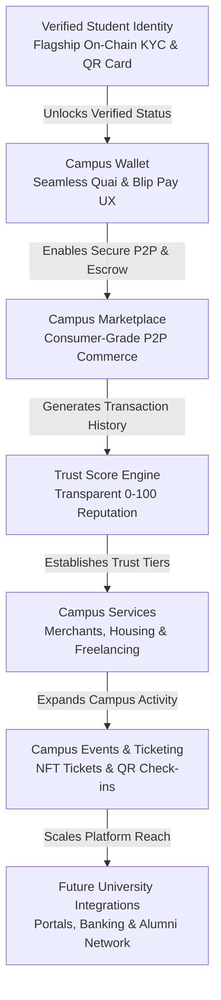

# CampusOS — Implementation Roadmap (Refactored & Enhanced)

> **Sources of Truth:** `CampusOS.pdf` (PRD) & `CampusOS Software Architecture.pdf` (SAD)  
> **Master Engineering Handbook:** `CampusOS_Engineering_Handbook_and_Roadmap.md` (Contains all 17 Engineering Guides, ADRs, QA/Deployment/Demo Checklists, and Standards)  
> **Project:** CampusOS — *"The trusted digital operating system for African universities."*  
> **Architecture Style:** Modular Monolith (Hackathon MVP) with Microservice-Ready Domain Separation  
> **Rule:** Structural & Architectural Roadmap — **No Implementation Code Generated**  

---

## 1. Platform Vision & Architectural Lifecycle

CampusOS is **"The trusted digital operating system for African universities."**  

Unlike traditional payment apps or student forums that focus purely on isolated transactions, CampusOS establishes a **persistent, portable trust layer** across every dimension of campus life. Every payment, marketplace trade, peer review, and event registration contributes to a student's verifiable **Trust Score**, creating a scam-free campus economy powered by **Quai Network** (blockchain verification & escrow) and **Blip Pay** (secure campus payments).



---

## 2. Universal Milestone Deliverable Standard (Mandatory 9-Point Checklist)

Every milestone below is **independently testable, deployable, and results in a working demo**. Before marking any milestone complete, the engineering team must satisfy the following 9 deliverables:
1. [x] **Working Frontend:** Deployed and verified on Vercel preview URL.
2. [x] **Working Backend:** Deployed and verified on Railway preview URL.
3. [x] **Database Migration:** Alembic migration scripts tested (`upgrade head` / `downgrade -1`).
4. [x] **API Documentation:** Interactive OpenAPI/Swagger spec live at `/docs`.
5. [x] **Unit Tests:** Pytest (backend) and Jest/Vitest (frontend) suites passing with >85% coverage.
6. [x] **Integration Tests:** End-to-end API lifecycle and UI component tests passing.
7. [x] **Manual Testing Checklist:** Role-based walkthrough completed across desktop and mobile viewports.
8. [x] **Git Checkpoint:** Tagged release branch (`v0.X.0-milestone-X`) merged via Pull Request.
9. [x] **Demo Checklist:** Curated sample data and demo script ready for judges.

---

## 3. Refactored Milestone Implementation Schedule

### Milestone 1: Project Scaffolding, Core Infrastructure & Engineering Baseline
* **Goal:** Initialize the Modular Monolith structure for Next.js 15 (App Router) and FastAPI, configure PostgreSQL with SQLAlchemy 2.0 ORM and Alembic, establish Quai Network SDK testnet connectivity, and implement core middleware (error handling, structured logging, CORS, rate limiting).
* **Estimated Files:**
  * `frontend/app/layout.tsx`, `frontend/middleware.ts`, `frontend/services/apiClient.ts`, `frontend/types/common.ts`, `frontend/utils/config.ts`
  * `backend/app/main.py`, `backend/app/core/config.py`, `backend/app/core/database.py`, `backend/app/core/security.py`, `backend/app/middleware/exception_handler.py`, `backend/app/middleware/logger.py`, `backend/app/middleware/rate_limit.py`
  * `backend/alembic.ini`, `backend/alembic/env.py`, `backend/alembic/versions/0001_initial_base.py`
* **Database Changes:** Configure PostgreSQL connection pooling (Supabase/Neon). Setup SQLAlchemy declarative base with UTC timestamp and UUID primary key mixins.
* **APIs:** 
  * `GET /health` — Returns system status, database latency, and Quai RPC node readiness.
* **UI Components:**
  * `RootLayout` — Global layout with theme and font styling.
  * `Navbar` & `Footer` — Common navigation header and footer shell.
  * `ToastProvider` — shadcn/ui global notification wrapper.
  * `ErrorBoundary` — Application-wide crash fallback display.
* **Smart Contracts:** Hardhat / Foundry development workspace configured for Quai Network testnet.
* **Testing:**
  * Backend health probe & configuration unit test (`test_health.py`).
  * DB session transactional lifecycle & rollback test (`test_database.py`).
  * Frontend root layout mount & API client latency smoke test.

---

### Milestone 2: Authentication, Clerk/JWT Integration & RBAC Core
* **Goal:** Implement seamless user onboarding supporting modern authentication (Clerk / JWT compatibility), Role-Based Access Control (Student, Merchant, Admin), password reset flows, and user profile management.
* **Estimated Files:**
  * `backend/app/models/user.py`
  * `backend/app/schemas/auth.py`, `backend/app/schemas/user.py`
  * `backend/app/api/auth.py`, `backend/app/api/users.py`
  * `backend/app/services/auth_service.py`, `backend/app/services/user_service.py`
  * `backend/app/middleware/auth_middleware.py`
  * `frontend/app/(auth)/login/page.tsx`, `frontend/app/(auth)/register/page.tsx`, `frontend/app/(dashboard)/profile/page.tsx`
  * `frontend/services/authService.ts`, `frontend/store/authStore.ts`, `frontend/components/common/AuthGuard.tsx`
* **Database Changes:**
  * Create **`Users`** table: `id` (PK, UUID), `name` (String), `email` (String, Unique), `wallet_address` (String, Nullable/Unique), `student_id` (String, Nullable), `school` (String), `faculty` (String), `department` (String), `level` (String), `trust_score` (Integer, Default: `50`), `verification_status` (Enum: `pending`, `verified`, `rejected`, Default: `pending`), `role` (Enum: `student`, `merchant`, `admin`, Default: `student`), `created_at` (Timestamp).
* **APIs:**
  * `POST /auth/register` — Register student or merchant account.
  * `POST /auth/login` — Authenticate and issue signed JWT / session token.
  * `POST /auth/logout` — Invalidate user session.
  * `GET /auth/profile` — Retrieve current authenticated profile and trust status.
  * `PUT /auth/profile` — Update editable profile fields.
* **UI Components:**
  * `LoginForm` & `RegisterForm` — Zod-validated authentication modals.
  * `ProfileHeader` & `ProfileForm` — Editable profile view with role badge display.
  * `RoleBadge` — Component displaying Student, Merchant, or Admin status.
  * `AuthGuard` — HOC/Wrapper protecting authenticated routes.
* **Smart Contracts:** None in this milestone.
* **Testing:**
  * JWT generation, validation, and expiration unit tests (`test_auth_service.py`).
  * E2E API tests for register, login, profile fetch, and profile edit (`test_auth_api.py`).
  * RBAC middleware tests verifying forbidden access when roles mismatch.

---

### Milestone 3: Flagship Verified Student Identity & Reusable Campus Identity QR (`StudentIdentity` Contract)
* **Goal:** Deliver the flagship Verified Student Identity module. Enable multi-document upload (Student ID, Admission Letter), university email verification (.edu.ng / institutional domain), an administrative review queue, SHA-256 cryptographic credential hashing, Quai Network on-chain registration, credential revocation/re-verification, and generation of a reusable **QR Campus Identity Card**.
* **Estimated Files:**
  * `backend/app/models/verification.py`, `backend/app/models/audit_log.py`
  * `backend/app/schemas/verification.py`
  * `backend/app/api/verification.py`
  * `backend/app/services/verification_service.py`, `backend/app/services/qr_service.py`
  * `backend/app/contracts/student_identity.py`
  * `frontend/app/(dashboard)/verification/page.tsx`, `frontend/app/(dashboard)/identity-card/page.tsx`
  * `frontend/components/verification/UploadForm.tsx`, `frontend/components/verification/StatusStepper.tsx`
  * `frontend/components/identity/QRIdentityCard.tsx`, `frontend/components/identity/CredentialModal.tsx`
  * `frontend/components/common/VerifiedBadge.tsx`
* **Database Changes:**
  * Create **`Verification`** table: `id` (PK, UUID), `user_id` (FK to Users.id), `student_id_document` (String Cloudinary URL), `admission_letter` (String Cloudinary URL), `university_email` (String, Nullable), `email_verified` (Boolean, Default: `False`), `status` (Enum: `pending`, `approved`, `rejected`, `revoked`), `approved_by` (FK to Users.id, Nullable), `credential_hash` (String, SHA-256 Hex), `approved_at` (Timestamp, Nullable), `rejection_reason` (Text, Nullable).
  * Create **`VerificationAudit`** table: `id` (PK, UUID), `verification_id` (FK), `old_status` (String), `new_status` (String), `changed_by` (FK to Users.id), `timestamp` (Timestamp).
* **APIs:**
  * `POST /verification/upload` — Submit verification documents and institutional email.
  * `GET /verification/status` — Fetch verification status, audit history, and credential hash.
  * `POST /verification/approve` — Admin endpoint: approve student, write hash to Quai contract, award `+10` Trust Score, and activate Verified Badge.
  * `POST /verification/reject` — Admin endpoint: reject verification with reason.
  * `POST /verification/revoke` — Admin endpoint: revoke credential on-chain and deduct Trust Score.
  * `GET /verification/card/{user_id}` — Public verification endpoint: validates cryptographic proof and returns QR Campus Identity status.
* **UI Components:**
  * `UploadForm` — Document uploader with Cloudinary progress indicator.
  * `StatusStepper` — Visual stepper showing: Documents Submitted ➔ Admin Under Review ➔ On-Chain Registration ➔ Verified.
  * `QRIdentityCard` — Reusable digital campus ID card displaying student photo, name, department, Verified Badge, and scannable QR code.
  * `CredentialModal` — Shows SHA-256 hash, Quai transaction receipt, and verification history.
  * `VerifiedBadge` — Universal SVG badge displayed next to verified usernames across the platform.
* **Smart Contracts:**
  * **`StudentIdentity` Contract (Quai Network):**
    * Functions: `registerStudent(address user, bytes32 credHash)`, `verifyStudent(address user)`, `revokeStudent(address user)`, `isVerified(address user)`, `getCredentialHash(address user)`.
* **Testing:**
  * SHA-256 document hashing & email domain validation unit tests (`test_verification_service.py`).
  * Smart contract unit tests on local Hardhat/Foundry network (`test_student_identity.sol`).
  * E2E test: Student upload ➔ Admin approve ➔ Quai hash recorded ➔ QR card live ➔ Trust Score increased by `+10`.

---

### Milestone 4: Seamless Campus Wallet & QR P2P Payments (`ReceiptRegistry` Contract)
* **Goal:** Provide a frictionless, consumer-app wallet experience. Hide complex blockchain terminology behind simple UI actions (`Connect Wallet` ➔ `Ready`). Enable native Quai balance lookups, paginated transaction histories, and instant QR-code-based peer-to-peer (P2P) campus payments backed by immutable on-chain receipt logging via the **`ReceiptRegistry`** contract.
* **Estimated Files:**
  * `backend/app/models/transaction.py`
  * `backend/app/schemas/wallet.py`, `backend/app/schemas/transaction.py`
  * `backend/app/api/wallet.py`
  * `backend/app/services/wallet_service.py`
  * `backend/app/contracts/receipt_registry.py`
  * `frontend/app/(dashboard)/wallet/page.tsx`
  * `frontend/components/wallet/WalletConnectModal.tsx`, `frontend/components/wallet/BalanceCard.tsx`
  * `frontend/components/wallet/TransactionList.tsx`, `frontend/components/wallet/QRPaymentModal.tsx`
  * `frontend/components/wallet/SendMoneyModal.tsx`
* **Database Changes:**
  * Create **`Transactions`** table: `id` (PK, UUID), `wallet` (String, sender wallet), `receiver` (String, receiver wallet or merchant ID), `amount` (Decimal), `tx_hash` (String, Quai Tx receipt hash), `status` (Enum: `pending`, `confirmed`, `failed`), `type` (Enum: `p2p`, `marketplace`, `event`), `network` (String, Default: `Quai`), `timestamp` (Timestamp).
* **APIs:**
  * `POST /wallet/connect` — Link user account to Quai wallet via off-chain cryptographic signature challenge.
  * `GET /wallet` — Fetch connected wallet status and address.
  * `GET /wallet/balance` — Fetch real-time Quai balance and formatted fiat equivalent.
  * `GET /wallet/history` — Retrieve paginated transaction history with filtering.
  * `POST /wallet/send` — Submit P2P payment, broadcast on Quai, and store receipt in `ReceiptRegistry`.
* **UI Components:**
  * `WalletConnectModal` — Seamless one-click wallet connector.
  * `BalanceCard` — Clean card showing total balance, Quai network badge, and quick action buttons (`Send`, `Receive`, `Scan`).
  * `TransactionList` — Activity feed displaying counterparties, transaction hash, status badges, and timestamps.
  * `QRPaymentModal` — Scannable QR code generator for instant campus merchant or peer payment requests.
  * `SendMoneyModal` — Intuitive transfer modal supporting recipient username/address or QR camera scan.
* **Smart Contracts:**
  * **`ReceiptRegistry` Contract (Quai Network):**
    * Functions: `storeReceipt(bytes32 txHash, address sender, address receiver, uint256 amount)`, `verifyReceipt(bytes32 txHash)`.
* **Testing:**
  * Wallet challenge signature generation and verification unit tests (`test_wallet_service.py`).
  * QR payload parser and payment request validation tests.
  * Smart contract test for storing and retrieving P2P transaction receipts (`test_receipt_registry.sol`).

---

### Milestone 5: Consumer-Grade Campus Marketplace, Blip Pay Checkout & Escrow (`MarketplaceEscrow` Contract)
* **Goal:** Build a modern, student-focused marketplace modeled after consumer apps (fast listing creation, rich product cards, image galleries, seller trust badges). Support student categories (Books, Electronics, Accommodation, Tutoring, Event Tickets, Campus Services). Integrate **Blip Pay API** for checkout, coordinate escrow locking/release via the **`MarketplaceEscrow`** smart contract, and automatically award Trust Score bonuses (`+5` to Buyer and Seller).
* **Estimated Files:**
  * `backend/app/models/marketplace.py`, `backend/app/models/order.py`
  * `backend/app/schemas/marketplace.py`, `backend/app/schemas/payment.py`
  * `backend/app/api/marketplace.py`, `backend/app/api/payments.py`
  * `backend/app/services/marketplace_service.py`, `backend/app/services/payment_service.py`
  * `backend/app/contracts/marketplace_escrow.py`
  * `frontend/app/(dashboard)/marketplace/page.tsx`, `frontend/app/(dashboard)/marketplace/[id]/page.tsx`, `frontend/app/(dashboard)/checkout/[id]/page.tsx`
  * `frontend/components/marketplace/ListingGrid.tsx`, `frontend/components/marketplace/ListingCard.tsx`
  * `frontend/components/marketplace/ListingFormModal.tsx`, `frontend/components/marketplace/ImageGallery.tsx`
  * `frontend/components/marketplace/SellerProfileCard.tsx`, `frontend/components/marketplace/CheckoutModal.tsx`
  * `frontend/components/marketplace/EscrowActions.tsx`
* **Database Changes:**
  * Create **`Marketplace`** table: `id` (PK, UUID), `seller_id` (FK to Users.id), `title` (String), `description` (Text), `category` (Enum: `books`, `electronics`, `accommodation`, `tutoring`, `tickets`, `services`), `price` (Decimal), `images` (ARRAY of String URLs), `status` (Enum: `active`, `pending_order`, `sold`, `suspended`), `created_at` (Timestamp).
  * Create **`Orders`** table: `id` (PK, UUID), `buyer_id` (FK to Users.id), `listing_id` (FK to Marketplace.id), `seller_id` (FK to Users.id), `amount` (Decimal), `payment_hash` (String, Blip transaction reference), `status` (Enum: `initiated`, `escrow_locked`, `completed`, `refunded`, `disputed`), `created_at` (Timestamp).
* **APIs:**
  * `GET /marketplace` — Filterable listing catalog (search, category, price range, seller trust score).
  * `POST /marketplace` — Create marketplace listing (requires Verified Student Identity).
  * `GET /marketplace/{id}` | `PUT /marketplace/{id}` | `DELETE /marketplace/{id}` — Listing detail and seller management endpoints.
  * `POST /payments/initiate` — Initiate Blip Pay checkout and create `initiated` order.
  * `POST /payments/webhook` — Secure webhook validated by HMAC signature: confirms Blip payment and transitions order to `escrow_locked`.
  * `POST /payments/escrow/release` — Confirms delivery, releases escrow funds (`MarketplaceEscrow.release()`), and awards `+5` Trust Score to Buyer and Seller.
  * `POST /payments/escrow/dispute` — Opens dispute for admin resolution.
* **UI Components:**
  * `ListingGrid` & `CategoryFilterBar` — Fast, responsive marketplace discovery grid.
  * `ListingCard` — Product preview card displaying seller trust score, Verified Badge, price, and cover image.
  * `ListingFormModal` — Simplified 3-step listing creator with Cloudinary drag-and-drop image upload.
  * `ImageGallery` — Carousel viewing component for product images.
  * `SellerProfileCard` — Seller sidebar showing total sales, Trust Score gauge, and verification credentials.
  * `CheckoutModal` — Blip Pay checkout drawer showing itemized breakdown and escrow guarantee terms.
  * `EscrowActions` — Buyer/Seller action bar (`Confirm Receipt` / `Request Refund` / `Open Dispute`).
* **Smart Contracts:**
  * **`MarketplaceEscrow` Contract (Quai Network):**
    * Functions: `createEscrow(bytes32 orderId, address buyer, address seller, uint256 amount)`, `deposit(bytes32 orderId)`, `release(bytes32 orderId)`, `refund(bytes32 orderId)`, `cancel(bytes32 orderId)`.
* **Testing:**
  * Blip Pay webhook HMAC-SHA256 signature verification unit tests (`test_payment_service.py`).
  * Escrow smart contract state machine tests (`test_marketplace_escrow.sol`): verifies funds cannot be released without mutual confirmation or admin dispute ruling.
  * E2E checkout integration test: Listing created ➔ Blip checkout initiated ➔ Webhook received ➔ Escrow locked ➔ Delivery confirmed ➔ Escrow released ➔ Trust Score updated (`+5` each).

---

### Milestone 6: Transparent Trust Score Engine & Reputation Registry (`TrustRegistry` Contract)
* **Goal:** Implement the transparent, deterministic Trust Score Engine. Enforce strict 0–100 boundary rules (starting baseline 50), post-transaction peer reviews, fraud dispute reporting, and on-chain synchronization via the **`TrustRegistry`** contract.
* **Estimated Files:**
  * `backend/app/models/review.py`, `backend/app/models/trust_log.py`
  * `backend/app/schemas/trust.py`, `backend/app/schemas/review.py`
  * `backend/app/api/trust.py`, `backend/app/api/reviews.py`
  * `backend/app/services/trust_service.py`
  * `backend/app/contracts/trust_registry.py`
  * `frontend/app/(dashboard)/trust/page.tsx`
  * `frontend/components/trust/TrustScoreGauge.tsx`, `frontend/components/trust/TrustRulesModal.tsx`
  * `frontend/components/trust/TrustHistoryTimeline.tsx`, `frontend/components/trust/ReviewModal.tsx`
  * `frontend/components/trust/ReviewList.tsx`, `frontend/components/trust/FraudReportModal.tsx`
* **Database Changes:**
  * Create **`Reviews`** table: `id` (PK, UUID), `reviewer_id` (FK to Users.id), `reviewee_id` (FK to Users.id), `order_id` (FK to Orders.id), `rating` (Integer, 1–5), `comment` (Text), `created_at` (Timestamp).
  * Create **`TrustLogs`** table: `id` (PK, UUID), `user_id` (FK to Users.id), `event_type` (String), `score_change` (Integer), `new_score` (Integer), `reference_id` (String), `created_at` (Timestamp).
* **Transparent Scoring Rules (Bounded `0` to `100`, Starting Baseline `50`):**
  ```
  Positive Modifiers:
    +10   Verified Student Identity Approved
    +5    Successful Marketplace Purchase Completed
    +5    Successful Marketplace Sale Completed
    +2    Positive Peer Review Received (Rating >= 4 stars)
    +3    Campus Event Attendance Verified

  Negative Modifiers:
    -10   Confirmed Fraud Report / Scam Activity
    -5    Chargeback Triggered
    -5    Marketplace Dispute Lost
    -3    Failed / Duplicated Payment Attempt
  ```
* **APIs:**
  * `GET /trust` — Fetch user Trust Score, ranking tier, and transparent score breakdown.
  * `GET /trust/history/{user_id}` — Fetch paginated ledger of all Trust Score events and adjustments.
  * `POST /trust/review` — Submit post-order review; triggers `+2` Trust Score if rating is 4 or 5 stars.
  * `POST /trust/report` — Submit formal fraud/scam report with transaction proof.
* **UI Components:**
  * `TrustScoreGauge` — Circular color-coded score meter (Red: 0–49, Yellow: 50–79, Green: 80–100).
  * `TrustRulesModal` — Transparency drawer explaining exact point additions and deductions.
  * `TrustHistoryTimeline` — Activity ledger showing historical trust adjustments and timestamps.
  * `ReviewModal` — Star-rating and comment dialog triggered after order completion.
  * `ReviewList` — Public reputation feedback list displayed on user profiles and marketplace items.
  * `FraudReportModal` — Dispute submission modal with evidence upload.
* **Smart Contracts:**
  * **`TrustRegistry` Contract (Quai Network):**
    * Functions: `updateScore(address user, uint256 newScore, bytes32 eventHash)`, `recordReview(address reviewer, address reviewee, uint8 rating)`, `recordFraud(address user, bytes32 evidenceHash)`, `getTrustScore(address user)`.
* **Testing:**
  * Math and boundary clamping unit tests (`0 <= score <= 100`) verifying score never underflows below 0 or overflows above 100 (`test_trust_service.py`).
  * Review duplication prevention unit tests (one review per order).
  * Smart contract test verifying on-chain `TrustRegistry` state mirrors DB trust score (`test_trust_registry.sol`).

---

### Milestone 7: Simplified Admin Governance & Security Dashboard
* **Goal:** Deliver a focused, uncluttered administrative governance dashboard. Admin capabilities are strictly limited to managing the verification queue, moderating marketplace listings, resolving fraud reports, applying account suspensions, inspecting the verification audit log, and viewing platform transaction monitoring KPIs.
* **Estimated Files:**
  * `backend/app/api/admin.py`
  * `backend/app/services/admin_service.py`
  * `frontend/app/(dashboard)/admin/page.tsx`, `frontend/app/(dashboard)/admin/verifications/page.tsx`, `frontend/app/(dashboard)/admin/reports/page.tsx`
  * `frontend/components/admin/AdminSidebar.tsx`, `frontend/components/admin/VerificationQueueTable.tsx`
  * `frontend/components/admin/ModerationTable.tsx`, `frontend/components/admin/FraudReportTable.tsx`
  * `frontend/components/admin/AnalyticsOverviewCard.tsx`, `frontend/components/admin/AuditLogModal.tsx`
* **Database Changes:**
  * Add administrative indexes on `Users.role`, `Users.verification_status`, `Marketplace.status`, and `Verification.status`.
  * Create **`AdminLogs`** table: `id` (PK, UUID), `admin_id` (FK to Users.id), `action` (String), `target_id` (String), `reason` (Text), `timestamp` (Timestamp).
* **APIs:**
  * `GET /admin/verifications` — Fetch pending student verification requests with document URLs.
  * `POST /admin/verifications/approve` / `POST /admin/verifications/reject` — Review actions.
  * `GET /admin/reports` — Fetch open fraud reports and disputed marketplace escrows.
  * `POST /admin/suspend` — Suspend user account, revoke Verified Badge (`StudentIdentity.revokeStudent()`), and deduct Trust Score (`-10`).
  * `GET /admin/analytics` — Fetch core KPIs: DAU, total verifications, transaction volume, and dispute count.
  * `GET /admin/audit-logs` — Fetch administrative activity audit logs.
* **UI Components:**
  * `AdminSidebar` — Simplified navigation menu (`Overview`, `Verifications`, `Marketplace`, `Disputes`, `Audit Logs`).
  * `VerificationQueueTable` — Side-by-side document inspection modal for rapid approval/rejection.
  * `ModerationTable` — Table for flagging or suspending marketplace listings.
  * `FraudReportTable` — Dispute resolution interface showing buyer/seller chat history and escrow release/refund buttons.
  * `AnalyticsOverviewCard` — Real-time KPI charts for judges and administrators.
  * `AuditLogModal` — Historical view of admin actions.
* **Smart Contracts:**
  * Integration with `StudentIdentity.revokeStudent()` and `TrustRegistry.recordFraud()`.
* **Testing:**
  * E2E administrative workflow test: Pending request ➔ Admin review table ➔ Approved ➔ Audit log created (`test_admin_api.py`).
  * RBAC authorization test verifying 403 Forbidden when Student/Merchant tokens access `/admin/*`.
  * Suspension integration test: verified student suspended ➔ trust score drops by 10 ➔ marketplace listings automatically suspended.

---

### Milestone 8 (Phase 2 Roadmap): Campus Events, NFT Ticketing & QR Check-in (`CampusEventNFT` Contract)
* **Goal:** Expand CampusOS into campus event management. Enable event organizers to create events, sell tickets via Blip Pay checkout, mint **NFT Event Tickets** on Quai Network, validate attendance via QR scanner check-ins, and award attendance Trust Score bonuses (`+3`).
* **Estimated Files:**
  * `backend/app/models/event.py`, `backend/app/models/ticket.py`
  * `backend/app/schemas/event.py`, `backend/app/schemas/ticket.py`
  * `backend/app/api/events.py`
  * `backend/app/services/event_service.py`
  * `backend/app/contracts/campus_event_nft.py`
  * `frontend/app/(dashboard)/events/page.tsx`, `frontend/app/(dashboard)/events/[id]/page.tsx`
  * `frontend/components/events/EventCatalog.tsx`, `frontend/components/events/EventCard.tsx`
  * `frontend/components/events/EventCreateModal.tsx`, `frontend/components/events/TicketQRModal.tsx`
  * `frontend/components/events/QRScannerModal.tsx`
* **Database Changes:**
  * Create **`Events`** table: `id` (PK, UUID), `title` (String), `description` (Text), `date` (Timestamp), `location` (String), `price` (Decimal), `organizer_id` (FK to Users.id), `nft_enabled` (Boolean, Default: `True`), `created_at` (Timestamp).
  * Create **`Tickets`** table: `id` (PK, UUID), `event_id` (FK to Events.id), `owner_id` (FK to Users.id), `nft_hash` (String, Nullable), `qr_payload` (String, Signed Token), `checked_in` (Boolean, Default: `False`), `checked_in_at` (Timestamp, Nullable).
* **APIs:**
  * `GET /events` | `POST /events` — Catalog and event creation endpoints.
  * `POST /events/register` — Register for event, initiate Blip Pay fee checkout, and trigger NFT ticket minting.
  * `POST /events/checkin` — QR Check-in scan endpoint: marks attendance and awards `+3` Trust Score.
* **UI Components:**
  * `EventCatalog` & `EventCard` — Discovery grid for campus workshops, social events, and club meetings.
  * `EventCreateModal` — Form for setting event date, ticket capacity, and NFT toggle.
  * `TicketQRModal` — Digital ticket modal displaying NFT hash and scannable check-in QR code.
  * `QRScannerModal` — Organizer camera check-in modal.
* **Smart Contracts:**
  * **`CampusEventNFT` Contract (Quai Network):**
    * Functions: `mintTicket(address attendee, uint256 eventId)`, `transferTicket(address from, address to, uint256 ticketId)`, `verifyTicket(uint256 ticketId)`, `burnTicket(uint256 ticketId)`.
* **Testing:**
  * NFT ticket minting and QR signed payload verification unit tests (`test_event_service.py`).
  * Double check-in prevention test: scanning an already checked-in QR returns 400 Bad Request.
  * Attendance Trust Score reward test (`+3` points on successful check-in).

---

## 4. Summary of Master Engineering Documents

All 17 engineering standards, checklists, templates, and ADRs are fully documented in **`CampusOS_Engineering_Handbook_and_Roadmap.md`**:

| Doc # | Document Title | Primary Description |
| :--- | :--- | :--- |
| **1** | **Updated Implementation Roadmap** | Refactored Milestones 1–8 with mandatory 9-point deployable demo checklists. |
| **2** | **Engineering Specification** | Performance SLAs (<200ms P95 API, <50ms DB, <1.8s LCP), off-chain PII, and security rules. |
| **3** | **Development Standards Guide** | Python PEP 8 (Ruff/Black), Next.js ESLint/Prettier, Pydantic/Zod schemas, WCAG AA accessibility. |
| **4** | **Folder Structure Documentation** | Full directory tree for `frontend/` (App Router) and `backend/` (FastAPI Modular Monolith). |
| **5** | **API Design Standards** | RESTful conventions, JSON success/error envelopes, HTTP status code mapping, pagination standard. |
| **6** | **Database Standards** | PostgreSQL UUID primary keys, UTC timestamps, FK cascade rules, indexing, and ERD architecture. |
| **7** | **Smart Contract Integration Standards** | Quai Network async transaction patterns, offline signing, receipt verification, and minimal storage. |
| **8** | **UI Component Standards** | TailwindCSS + shadcn primitives, atomic hierarchy, interactive loading states, error boundaries. |
| **9** | **Git Workflow Guide** | Trunk-based GitFlow strategy, Conventional Commits specification, and CI/CD PR review gates. |
| **10** | **Milestone Completion Checklist** | Universal 6-point sign-off checklist required before closing any milestone. |
| **11** | **QA Checklist** | Security, RBAC, trust boundary clamping, escrow safety, and accessibility QA matrix. |
| **12** | **Deployment Checklist** | Verification checklist for Vercel, Railway, Supabase/Neon, Cloudinary, and Quai Network testnet. |
| **13** | **Demo Readiness Checklist** | Buildathon demo prep: 3 pre-configured personas, 8 sample listings, live QR ID card, and backup video. |
| **14** | **Judge Evaluation Checklist** | Strategic alignment checklist against Quai × Blip Buildathon judging criteria. |
| **15** | **Technical Debt Log Template** | Structured table for logging and scheduling remediation of MVP technical debt. |
| **16** | **Risk Register** | Matrix of technical, blockchain, payment, and go-to-market risks with mitigation strategies. |
| **17** | **Architecture Decision Records (ADRs)** | ADR-001 (Modular Monolith), ADR-002 (Off-chain PII/On-chain Hash), ADR-003 (Bounded Trust), ADR-004 (Seamless UX). |
