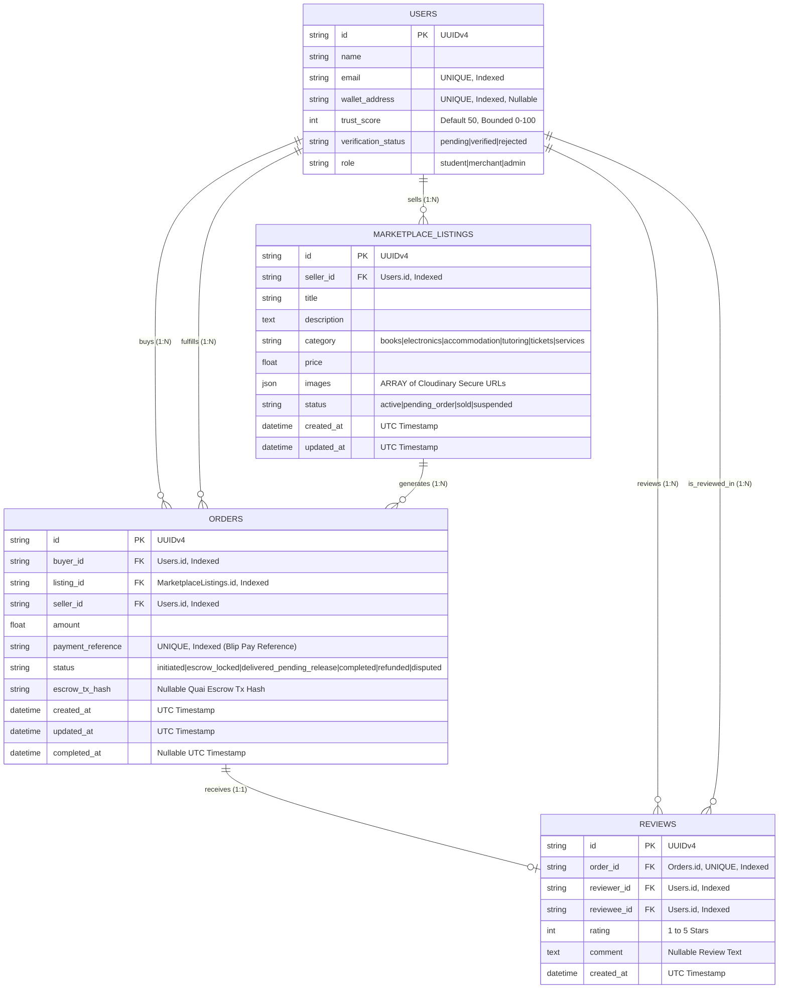
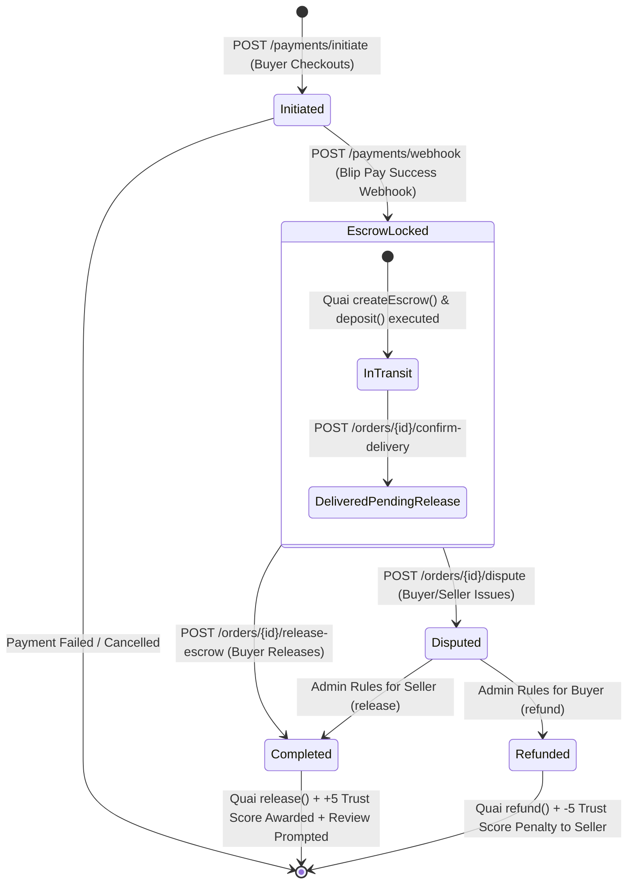

# CampusOS — Milestone 5: Marketplace, Escrow & Blip Pay
## Complete Architectural Blueprint & Step-by-Step Implementation Plan

> **Project:** CampusOS — *"The trusted digital operating system for African universities."*  
> **Milestone:** Milestone 5 — Trusted Campus Marketplace, Blip Pay Checkout & Quai Escrow Smart Contract  
> **Status:** Architecture & Specification Blueprint — **No Production Code Generated Yet**  

---

## Table of Contents
1. [Executive Summary & Architectural Objectives](#1-executive-summary--architectural-objectives)
2. [Architectural Conflict Analysis & Resolutions](#2-architectural-conflict-analysis--resolutions)
3. [Database Schema & Entity-Relationship Diagram (ERD)](#3-database-schema--entity-relationship-diagram-erd)
4. [SQLAlchemy 2.0 Models Specification](#4-sqlalchemy-20-models-specification)
5. [Alembic Migration Plan (`0004_create_marketplace_and_escrow_tables`)](#5-alembic-migration-plan)
6. [Repository Layer Specification](#6-repository-layer-specification)
7. [Service Layer Specification](#7-service-layer-specification)
8. [REST API Specification & Endpoints Table](#8-rest-api-specification--endpoints-table)
9. [Frontend Routes & UI Component Architecture](#9-frontend-routes--ui-component-architecture)
10. [Escrow State Machine & Blip Pay Payment Lifecycle](#10-escrow-state-machine--blip-pay-payment-lifecycle)
11. [Blip Pay Webhook Verification & Idempotency Engine](#11-blip-pay-webhook-verification--idempotency-engine)
12. [Trust Score Engine Integration](#12-trust-score-engine-integration)
13. [Smart Contract Integration Architecture (`MarketplaceEscrow.sol`)](#13-smart-contract-integration-architecture)
14. [Comprehensive Testing Strategy](#14-comprehensive-testing-strategy)
15. [Security & Deployment Considerations](#15-security--deployment-considerations)
16. [Step-by-Step Execution Schedule (Milestone 5 Roadmap)](#16-step-by-step-execution-schedule)

---

## 1. Executive Summary & Architectural Objectives

Milestone 5 introduces the consumer-grade **Campus Marketplace**, automated **Blip Pay Checkout**, and **Quai Network Escrow Smart Contract (`MarketplaceEscrow.sol`)** into the existing CampusOS Modular Monolith. 

The primary objective is to eradicate African university marketplace scams (e.g., WhatsApp fake payment screenshots, anonymous scam vendors) by establishing a verified peer-to-peer commerce layer where:
1. **Sellers are strictly gated by Verified Student Identity (`verification_status == 'verified'`).**
2. **Payments are processed securely via Blip Pay API and locked in Quai Network smart contract escrow.**
3. **Escrow release automatically awards verifiable +5 Trust Score bonuses to both Buyer and Seller.**

```
Verified Seller Lists Item (Books, Electronics, Housing, etc.)
                          │
                          ▼
       Buyer Initiates Checkout (POST /payments/initiate)
                          │
                          ▼
        Blip Pay Payment Processed & Signed Webhook Received
                          │
                          ▼
       Quai Network Smart Contract Escrow Locked (createEscrow)
                          │
                          ▼
       Seller Delivers Order ➔ Buyer Confirms Delivery
                          │
                          ▼
     Escrow Released (release) + Receipt Stored on Quai Network
                          │
                          ▼
      Trust Score Automatically Updated (+5 Buyer / +5 Seller)
```

---

## 2. Architectural Conflict Analysis & Resolutions

Before generating this plan, we audited existing Milestones 1–4 against Milestone 5 requirements to identify and resolve potential architectural friction points:

| Conflict Area | Potential Conflict / Friction | Architectural Resolution & Rule |
| :--- | :--- | :--- |
| **1. Seller Verification Gate** | Can unverified users create marketplace listings? | **Resolution:** Strictly enforce RBAC in `MarketplaceService.create_listing`: check `user.verification_status == 'verified'`. If unverified, raise `403 Forbidden ("You must possess an approved Verified Student Identity to list items for sale.")`. Unverified students can still browse and buy. |
| **2. Webhook Replay & Idempotency** | What if Blip Pay sends duplicate webhook retries for the same order? | **Resolution:** Ensure `OrderService.handle_webhook` checks `if order.status != 'initiated': return order`. This guarantees idempotency, preventing duplicate Quai escrow locking or duplicate Trust Score rewards. |
| **3. Offline / Demo Execution** | How can judges test checkout when Blip Pay API credentials or Quai testnet RPC are offline? | **Resolution:** Follow the established pattern from `StorageService` and `QuaiBlockchainService`: check `settings.USE_MOCK_BLIP_PAY` and `settings.USE_MOCK_BLOCKCHAIN`. In mock mode, generate deterministic sandbox references (`blip_mock_req_...`) and instant escrow confirmations. |
| **4. Concurrency on Inventory** | What happens if two buyers purchase the same unique item simultaneously? | **Resolution:** Use PostgreSQL row-level locking (`with_for_update()`) in `OrderService.initiate_checkout` when transitioning listing status from `'active'` to `'pending_order'` or `'sold'`. |

---

## 3. Database Schema & Entity-Relationship Diagram (ERD)

Milestone 5 introduces three new relational entities (`marketplace_listings`, `orders`, `reviews`) cleanly integrated with `users`, `student_verifications`, and `transactions`:



---

## 4. SQLAlchemy 2.0 Models Specification

### 4.1 `MarketplaceListing` (`app/models/marketplace.py`)
* `id`: `Column(String, primary_key=True, default=lambda: str(uuid.uuid4()))`
* `seller_id`: `Column(String, ForeignKey("users.id", ondelete="CASCADE"), nullable=False, index=True)`
* `title`: `Column(String, nullable=False)`
* `description`: `Column(Text, nullable=False)`
* `category`: `Column(String, nullable=False, index=True)` *(books, electronics, accommodation, tutoring, tickets, services)*
* `price`: `Column(Float, nullable=False)`
* `images`: `Column(JSON, nullable=False)` *(ARRAY of string Cloudinary image URLs)*
* `status`: `Column(String, default="active", nullable=False, index=True)`
* `created_at` / `updated_at`: UTC timestamps
* **Relationships:** `seller = relationship("User", foreign_keys=[seller_id])`, `orders = relationship("Order", back_populates="listing", cascade="all, delete-orphan")`

### 4.2 `Order` (`app/models/order.py`)
* `id`: `Column(String, primary_key=True, default=lambda: str(uuid.uuid4()))`
* `buyer_id` / `seller_id`: `Column(String, ForeignKey("users.id", ondelete="CASCADE"), nullable=False, index=True)`
* `listing_id`: `Column(String, ForeignKey("marketplace_listings.id", ondelete="RESTRICT"), nullable=False, index=True)`
* `amount`: `Column(Float, nullable=False)`
* `payment_reference`: `Column(String, unique=True, index=True, nullable=False)` *(Blip Pay checkout intent reference)*
* `status`: `Column(String, default="initiated", nullable=False, index=True)`
* `escrow_tx_hash`: `Column(String, nullable=True, index=True)`
* `created_at` / `updated_at` / `completed_at`: UTC timestamps
* **Relationships:** `buyer`, `seller`, `listing`, `review = relationship("Review", back_populates="order", uselist=False)`

### 4.3 `Review` (`app/models/review.py`)
* `id`: `Column(String, primary_key=True, default=lambda: str(uuid.uuid4()))`
* `order_id`: `Column(String, ForeignKey("orders.id", ondelete="CASCADE"), unique=True, nullable=False, index=True)`
* `reviewer_id` / `reviewee_id`: `Column(String, ForeignKey("users.id", ondelete="CASCADE"), nullable=False, index=True)`
* `rating`: `Column(Integer, nullable=False)` *(1–5)*
* `comment`: `Column(Text, nullable=True)`
* `created_at`: UTC timestamp

---

## 5. Alembic Migration Plan

### 5.1 Revision `0004_create_marketplace_and_escrow_tables`
* **Upgrade Plan:**
  1. Create table `marketplace_listings` with indexes on `seller_id`, `category`, `status`.
  2. Create table `orders` with unique index on `payment_reference` and indexes on `buyer_id`, `seller_id`, `listing_id`, `status`.
  3. Create table `reviews` with unique index on `order_id` and indexes on `reviewer_id`, `reviewee_id`.
  4. Create compound index `ix_marketplace_category_status` on `(category, status)`.
  5. Create compound index `ix_orders_buyer_status` on `(buyer_id, status)`.
* **Downgrade Plan:**
  1. Drop compound indexes and tables `reviews`, `orders`, `marketplace_listings` in reverse dependency order.

---

## 6. Repository Layer Specification

1. **`MarketplaceRepository` (`app/repositories/marketplace_repository.py`)**:
   * `create(listing)` / `get_by_id(listing_id)` / `update(listing)` / `delete(listing_id)`
   * `get_catalog(category=None, min_price=None, max_price=None, search_term=None, skip=0, limit=20)` -> returns active listings.
   * `get_by_seller(seller_id, skip=0, limit=20)` -> returns seller's listings.
2. **`OrderRepository` (`app/repositories/order_repository.py`)**:
   * `create(order)` / `get_by_id(order_id)` / `get_by_payment_reference(ref)` / `update(order)`
   * `get_by_buyer(buyer_id, skip=0, limit=20)` / `get_by_seller(seller_id, skip=0, limit=20)`
3. **`ReviewRepository` (`app/repositories/review_repository.py`)**:
   * `create(review)` / `get_by_order_id(order_id)` / `get_by_reviewee(user_id, skip=0, limit=20)`

---

## 7. Service Layer Specification

1. **`MarketplaceService` (`app/services/marketplace_service.py`)**:
   * **`create_listing(...)`**: Verifies `user.verification_status == 'verified'`. Validates images via `StorageService`. Creates `MarketplaceListing`.
   * **`get_catalog(...)`**: Executes filtered search with pagination.
   * **`update_listing(...)` / `delete_listing(...)`**: Verifies ownership (`listing.seller_id == user_id` or admin role).
2. **`PaymentService` (`app/services/payment_service.py`)**:
   * **`initiate_checkout(buyer_id, listing_id)`**: Locks listing row (`with_for_update`). Checks listing is `'active'`. Generates Blip Pay checkout intent (or sandbox reference `blip_mock_...`). Creates `Order(status='initiated')`. Returns payment URL and reference.
   * **`verify_webhook_signature(headers, body_bytes)`**: Constant-time HMAC-SHA256 signature checking against `settings.BLIP_PAY_WEBHOOK_SECRET`.
3. **`OrderService` (`app/services/order_service.py`)**:
   * **`handle_webhook(payment_reference, blip_status)`**:
     * Idempotency check: if `order.status != 'initiated'`, return order.
     * Updates order to `'escrow_locked'`.
     * Asynchronously calls `QuaiBlockchainService.createEscrow(order.id, buyer, seller, amount)` and `deposit(order.id)`.
     * Records `order.escrow_tx_hash`.
     * Updates listing status to `'pending_order'`.
   * **`confirm_delivery(order_id, user_id)`**:
     * Checks caller is buyer or seller. Transitions order to `'delivered_pending_release'`.
   * **`release_escrow(order_id, actor_id)`**:
     * Asynchronously calls `QuaiBlockchainService.release(order.id)` on Quai Network.
     * Transitions order to `'completed'`; sets `completed_at = utc_now()`.
     * Updates listing status to `'sold'`.
     * Calls `TrustService.award_order_completion_bonus(buyer_id, seller_id)`.
     * Creates P2P `Transaction` record for audit trail.
   * **`dispute_order(order_id, user_id, reason)`**: Transitions order to `'disputed'` for admin governance review.

---

## 8. REST API Specification & Endpoints Table

All endpoints use standardized JSON envelopes (`{"success": true, "data": ..., "error": null, "meta": ...}`) and are mounted under `/api/v1`:

| Route Endpoint | Method | Purpose | Authentication & RBAC Gate | Expected Status Codes |
| :--- | :---: | :--- | :--- | :---: |
| `/marketplace/listings` | `GET` | Filterable marketplace catalog (search, category, price, trust) | Public / Student | `200 OK` |
| `/marketplace/listings` | `POST` | Create marketplace listing with Cloudinary images | **Verified Student** (`verification_status == 'verified'`) | `201 Created` / `400` / `403` |
| `/marketplace/listings/{id}` | `GET` | Get single listing detail & seller profile | Public / Student | `200 OK` / `404` |
| `/marketplace/listings/{id}` | `PUT` / `DELETE` | Edit or delete marketplace listing | Seller or Admin | `200 OK` / `403` / `404` |
| `/payments/initiate` | `POST` | Initiate Blip Pay checkout & create pending order | Authenticated Student | `201 Created` / `400` / `404` |
| `/payments/webhook` | `POST` | Blip Pay HMAC-SHA256 validated webhook | **HMAC-SHA256 Signature Check** | `200 OK` / `401 Unauthorized` |
| `/orders/buyer/{user_id}` | `GET` | Get paginated orders as buyer | Buyer UUID | `200 OK` |
| `/orders/seller/{user_id}` | `GET` | Get paginated orders as seller | Seller UUID | `200 OK` |
| `/orders/{id}/confirm-delivery` | `POST` | Confirm physical delivery of item/service | Buyer or Seller | `200 OK` / `400` / `403` |
| `/orders/{id}/release-escrow` | `POST` | Release Quai escrow & award +5 Trust Score | Buyer or Admin | `200 OK` / `400` / `403` |
| `/orders/{id}/dispute` | `POST` | Open formal dispute on order | Buyer or Seller | `200 OK` / `400` / `403` |
| `/reviews/order/{id}` | `POST` | Submit post-order review (+2 Trust Score on >=4 stars) | Order Buyer or Seller | `201 Created` / `400` / `409` |

---

## 9. Frontend Routes & UI Component Architecture

```
/home/user/frontend/
├── app/
│   ├── marketplace/
│   │   ├── page.tsx               # Marketplace Catalog Page (/marketplace)
│   │   └── [id]/page.tsx          # Listing Detail Page (/marketplace/[id])
│   ├── checkout/
│   │   └── [id]/page.tsx          # Blip Pay Checkout & Escrow Lock Page (/checkout/[id])
│   └── orders/
│       └── page.tsx               # My Orders & Escrow Management Page (/orders)
└── components/
    └── marketplace/
        ├── ListingGrid.tsx        # Responsive filterable listing grid
        ├── ListingCard.tsx        # Product card with seller trust score & verified badge
        ├── ListingFormModal.tsx   # 3-step listing creation modal with Cloudinary drag-and-drop
        ├── ImageGallery.tsx       # Product photo carousel
        ├── SellerProfileCard.tsx  # Seller sidebar with Trust Score gauge and credentials
        ├── CheckoutModal.tsx      # Blip Pay checkout intent and escrow lock preview
        └── EscrowActions.tsx      # Buyer/Seller action bar (Confirm Delivery / Release / Dispute)
```

---

## 10. Escrow State Machine & Blip Pay Payment Lifecycle



---

## 11. Blip Pay Webhook Verification & Idempotency Engine

To prevent webhook spoofing or replay attacks, all incoming requests to `POST /api/v1/payments/webhook` execute this strict verification sequence:
1. **Header Inspection:** Read `X-Blip-Signature` header containing HMAC-SHA256 hex digest.
2. **Signature Re-Computation:** Compute `hmac.new(settings.BLIP_PAY_WEBHOOK_SECRET, raw_body_bytes, sha256).hexdigest()`.
3. **Constant-Time Comparison:** Use `hmac.compare_digest(expected_sig, received_sig)`. If mismatched, raise `401 Unauthorized` immediately.
4. **Idempotency Check:** Look up order by `payment_reference`. If `order.status != 'initiated'`, log `"Duplicate webhook received for order {order.id}; ignoring"` and return `200 OK`.

---

## 12. Trust Score Engine Integration

Milestone 5 integrates deterministic Trust Score modifiers bounded between `0` and `100` (`app/services/trust_service.py`):

| Transaction Event Trigger | Score Modifier | Condition & Audit Trail Description |
| :--- | :---: | :--- |
| **Successful Marketplace Purchase** | **`+5`** | Awarded to Buyer upon `release_escrow`. Logged in `VerificationHistory` / `TrustLogs`. |
| **Successful Marketplace Sale** | **`+5`** | Awarded to Seller upon `release_escrow`. Logged in `VerificationHistory` / `TrustLogs`. |
| **Positive Peer Review Received** | **`+2`** | Awarded to Seller if post-order review rating is `4` or `5` stars (`POST /reviews/order/{id}`). |
| **Order Refunded / Chargeback** | **`-5`** | Deducted from Seller if escrow is refunded due to item non-delivery or dispute ruling. |
| **Confirmed Marketplace Fraud** | **`-10`** | Deducted by Admin if scam listing is confirmed; automatically suspends seller account. |

---

## 13. Smart Contract Integration Architecture (`MarketplaceEscrow.sol`)

The backend EVM service (`QuaiBlockchainService`) interacts with `MarketplaceEscrow.sol` deployed on Quai EVM Testnet (Chain ID 9000):

```solidity
interface IMarketplaceEscrow {
    function createEscrow(bytes32 orderId, address buyer, address seller, uint256 amount) external;
    function deposit(bytes32 orderId) external payable;
    function release(bytes32 orderId) external;
    function refund(bytes32 orderId) external;
    function cancel(bytes32 orderId) external;
}
```
* **Asynchronous Web3 Calls:** All calls (`createEscrow`, `deposit`, `release`, `refund`) execute in non-blocking worker threads (`asyncio.to_thread`).
* **Transaction Receipt Storage:** Every escrow state change records `escrow_tx_hash` on the `Order` table in PostgreSQL and logs immutable proof on Quai Network's `ReceiptRegistry.sol`.

---

## 14. Comprehensive Testing Strategy

Every milestone deliverable must achieve **>85% test coverage** before completion:
1. **Unit Tests (`tests/test_marketplace_service.py`, `tests/test_payment_service.py`):**
   * Seller verification gate (`verification_status == 'verified'`) authorization tests.
   * Blip Pay webhook HMAC-SHA256 signature verification and tamper rejection tests.
   * Order state machine transition tests (`initiated` ➔ `escrow_locked` ➔ `completed`).
2. **Smart Contract Unit Tests (`contracts/test/MarketplaceEscrow.test.ts`):**
   * Hardhat + Chai Solidity tests verifying deposit, release, refund, and access control on Quai Testnet.
3. **Integration & API Tests (`tests/test_marketplace_api.py`, `tests/test_order_api.py`):**
   * End-to-end integration test: Seller listing creation ➔ Buyer Blip checkout ➔ Webhook lock ➔ Escrow release ➔ Trust Score bonus (+5 Buyer / +5 Seller) ➔ Review submission (+2).
4. **Frontend Component Tests (`test/ListingCard.test.tsx`, `test/CheckoutModal.test.tsx`):**
   * Vitest component tests verifying price formatting, trust badge rendering, and escrow action buttons.

---

## 15. Security & Deployment Considerations

* **OWASP Hardening:**
  * **Magic Bytes & Filename Sanitization:** Uploaded product images undergo OWASP magic-bytes checking (`%PDF-`, `\xFF\xD8\xFF`, `\x89PNG`, `RIFF/WEBP`) in `StorageService`.
  * **Rate Limiting:** `/payments/initiate` and `/payments/webhook` are protected by `RateLimitMiddleware` (max 30 req/min per IP).
  * **CORS & SSL:** Restricted to trusted Vercel production domains; webhooks must be received over HTTPS.
* **Environment Variables (`.env` / `app/core/config.py`):**
  ```env
  BLIP_PAY_API_KEY=mock_blip_api_key
  BLIP_PAY_WEBHOOK_SECRET=campusos-blip-webhook-secret-2026
  USE_MOCK_BLIP_PAY=True  # Set to False in production
  QUAI_ESCROW_CONTRACT_ADDRESS=0xYourMarketplaceEscrowAddressHere
  ```

---

## 16. Step-by-Step Execution Schedule (Milestone 5 Roadmap)

When implementation begins, the engineering team will execute this exact schedule without redesigning any existing module:

```
[Phase 5.1: Backend Models & Alembic Migration]
  ├── Create app/models/marketplace.py, app/models/order.py, app/models/review.py
  ├── Create alembic/versions/0004_create_marketplace_and_escrow_tables.py
  └── Verify alembic upgrade head & downgrade -1 compatibility

[Phase 5.2: Repository & Domain Service Layer]
  ├── Create app/repositories/marketplace_repository.py, order_repository.py, review_repository.py
  ├── Create app/services/marketplace_service.py (with Verified Student RBAC gate)
  ├── Create app/services/payment_service.py (with Blip Pay HMAC webhook validation)
  ├── Create app/services/order_service.py (with QuaiBlockchainService escrow binding)
  └── Create app/services/trust_service.py (+5 Buy, +5 Sell, +2 Review rules)

[Phase 5.3: Quai Smart Contract Setup]
  ├── Write contracts/contracts/MarketplaceEscrow.sol & test/MarketplaceEscrow.test.ts
  └── Export ABI to app/contracts/marketplace_escrow_abi.json

[Phase 5.4: REST API Routers & OpenAPI Sync]
  ├── Create app/api/v1/marketplace.py, payments.py, orders.py, reviews.py
  ├── Mount routers in app/api/v1/__init__.py
  └── Verify /docs & export openapi.json

[Phase 5.5: Automated Test Suite Execution]
  ├── Write tests/test_marketplace_service.py, test_payment_service.py, test_order_api.py
  └── Execute pytest -v && ruff check app tests (100% pass rate required)

[Phase 5.6: Next.js 15 Frontend UI Suite]
  ├── Create app/marketplace/page.tsx, app/marketplace/[id]/page.tsx, app/checkout/[id]/page.tsx
  ├── Create components/marketplace/* (ListingGrid, ListingCard, ListingFormModal, CheckoutModal, EscrowActions)
  ├── Write Vitest component tests in frontend/test/
  └── Execute npm test && npm run build (0 build errors required)
```
