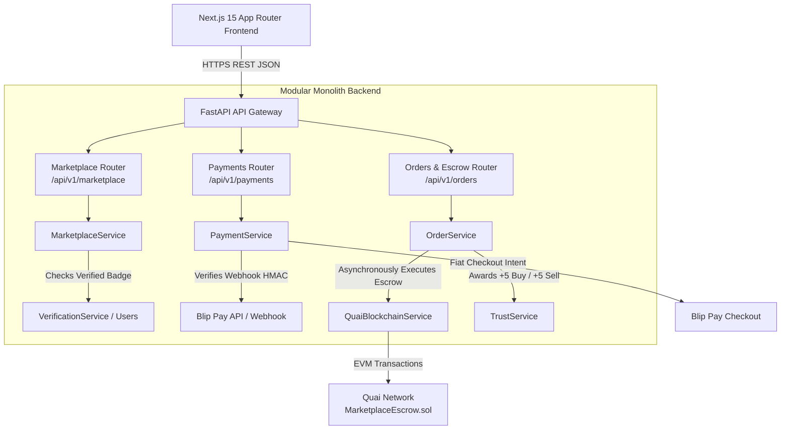
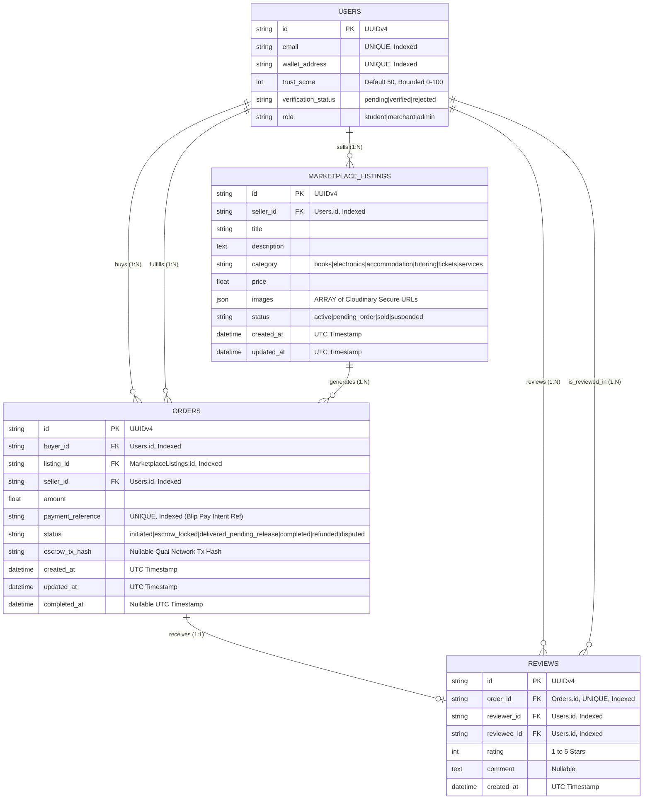
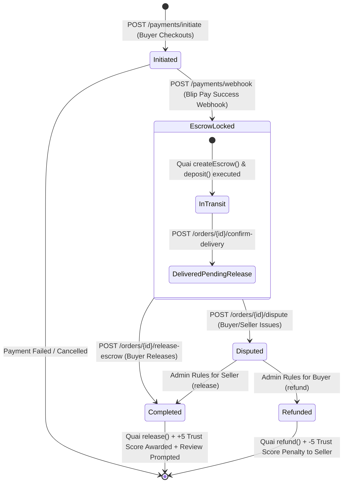

# CampusOS — Milestone 5: Marketplace, Escrow & Blip Pay
## Complete Architectural Review & Engineering Specification

> **Project:** CampusOS — *"The trusted digital operating system for African universities."*  
> **Milestone:** Milestone 5 — Trusted Campus Marketplace, Blip Pay Checkout & Quai Escrow Smart Contract  
> **Rule:** Complete Engineering Specification & Architecture Review — **No Production Code Generated Yet**  
> **Status:** Authoritative Implementation Blueprint  

---

## Table of Contents
1. [Marketplace Architecture & Modular Monolith Topology](#1-marketplace-architecture--modular-monolith-topology)
2. [Database Design (PostgreSQL / SQLAlchemy 2.0 / Alembic)](#2-database-design-postgresql--sqlalchemy-20--alembic)
3. [API Design (RESTful Endpoints & Pydantic v2 Schemas)](#3-api-design-restful-endpoints--pydantic-v2-schemas)
4. [Frontend Component Tree & Next.js 15 Routing](#4-frontend-component-tree--nextjs-15-routing)
5. [Smart Contract Integration (`MarketplaceEscrow.sol`)](#5-smart-contract-integration-marketplaceescrosol)
6. [Blip Pay Integration & Payment Lifecycle](#6-blip-pay-integration--payment-lifecycle)
7. [Security Plan & OWASP Threat Controls](#7-security-plan--owasp-threat-controls)
8. [Repository Layer Specification](#8-repository-layer-specification)
9. [Service Layer Specification & Trust Score Rules](#9-service-layer-specification--trust-score-rules)
10. [Comprehensive Testing Strategy](#10-comprehensive-testing-strategy)

---

## 1. Marketplace Architecture & Modular Monolith Topology

Milestone 5 extends the existing CampusOS **Modular Monolith** by adding three core business modules: **Marketplace**, **Payments (Blip Pay)**, and **Orders/Escrow (Quai Network)**. 

### 1.1 Core Architectural Principles
* **Verified Seller Gating:** In accordance with the PRD and SAD, creating a marketplace listing (`POST /api/v1/marketplace/listings`) strictly requires that the student has an approved Verified Student Identity (`verification_status == 'verified'`). Unverified students can browse and purchase items, but cannot act as sellers.
* **Domain Isolation:** The new modules are encapsulated within `app/api/v1/`, `app/services/`, `app/repositories/`, and `app/models/`. They interact with existing domains (`VerificationService`, `WalletService`, `QuaiBlockchainService`) exclusively via internal Python method calls and shared database transactions—never via external HTTP hops.
* **Asynchronous Web3 Execution:** All smart contract interactions (`createEscrow`, `deposit`, `release`, `refund`) are executed asynchronously via `asyncio.to_thread`, ensuring the FastAPI event loop is never blocked.



---

## 2. Database Design (PostgreSQL / SQLAlchemy 2.0 / Alembic)

Milestone 5 introduces three new tables: `marketplace_listings`, `orders`, and `reviews`, fully integrated with existing `users`, `student_verifications`, and `transactions`.

### 2.1 Entity-Relationship Diagram (ERD)


### 2.2 SQLAlchemy 2.0 Models Specification
1. **`MarketplaceListing` (`app/models/marketplace.py`)**:
   * `id`: `Column(String, primary_key=True, default=lambda: str(uuid.uuid4()))`
   * `seller_id`: `Column(String, ForeignKey("users.id", ondelete="CASCADE"), nullable=False, index=True)`
   * `title`: `Column(String, nullable=False)`
   * `description`: `Column(Text, nullable=False)`
   * `category`: `Column(String, nullable=False, index=True)` *(books, electronics, accommodation, tutoring, tickets, services)*
   * `price`: `Column(Float, nullable=False)`
   * `images`: `Column(JSON, nullable=False)` *(ARRAY of string Cloudinary URLs)*
   * `status`: `Column(String, default="active", nullable=False, index=True)`
   * `created_at` / `updated_at`: UTC timestamps
2. **`Order` (`app/models/order.py`)**:
   * `id`: `Column(String, primary_key=True, default=lambda: str(uuid.uuid4()))`
   * `buyer_id` / `seller_id`: `Column(String, ForeignKey("users.id", ondelete="CASCADE"), nullable=False, index=True)`
   * `listing_id`: `Column(String, ForeignKey("marketplace_listings.id", ondelete="RESTRICT"), nullable=False, index=True)`
   * `amount`: `Column(Float, nullable=False)`
   * `payment_reference`: `Column(String, unique=True, index=True, nullable=False)` *(Blip Pay order reference)*
   * `status`: `Column(String, default="initiated", nullable=False, index=True)`
   * `escrow_tx_hash`: `Column(String, nullable=True, index=True)`
   * `created_at` / `updated_at` / `completed_at`: UTC timestamps
3. **`Review` (`app/models/review.py`)**:
   * `id`: `Column(String, primary_key=True, default=lambda: str(uuid.uuid4()))`
   * `order_id`: `Column(String, ForeignKey("orders.id", ondelete="CASCADE"), unique=True, nullable=False, index=True)`
   * `reviewer_id` / `reviewee_id`: `Column(String, ForeignKey("users.id", ondelete="CASCADE"), nullable=False, index=True)`
   * `rating`: `Column(Integer, nullable=False)` *(1–5)*
   * `comment`: `Column(Text, nullable=True)`
   * `created_at`: UTC timestamp

### 2.3 Alembic Migration Plan (`0004_create_marketplace_and_escrow_tables`)
* **Upgrade:**
  1. Create `marketplace_listings`, `orders`, and `reviews` tables.
  2. Create compound index `ix_marketplace_category_status` on `(category, status)`.
  3. Create compound index `ix_orders_buyer_status` on `(buyer_id, status)` and `ix_orders_seller_status` on `(seller_id, status)`.
* **Downgrade:**
  1. Drop compound indexes and drop tables `reviews`, `orders`, and `marketplace_listings` in reverse order.

---

## 3. API Design (RESTful Endpoints & Pydantic v2 Schemas)

All endpoints return standardized JSON envelopes (`{"success": true, "data": ..., "error": null, "meta": ...}`) mounted under `/api/v1`:

### 3.1 Endpoint Specification Table
| Route Endpoint | Method | Purpose | Authentication & RBAC Gate | Expected Status Codes |
| :--- | :---: | :--- | :--- | :---: |
| `/marketplace/listings` | `GET` | Filterable marketplace catalog (search, category, price, trust) | Public / Student | `200 OK` |
| `/marketplace/listings` | `POST` | Create marketplace listing with Cloudinary images | **Verified Student** (`verification_status == 'verified'`) | `201 Created` / `400` / `403` |
| `/marketplace/listings/{id}` | `GET` | Get single listing detail & seller profile | Public / Student | `200 OK` / `404` |
| `/marketplace/listings/{id}` | `PUT` / `DELETE` | Edit or delete marketplace listing | Seller or Admin | `200 OK` / `403` / `404` |
| `/payments/initiate` | `POST` | Initiate Blip Pay checkout intent and create pending order | Authenticated Student | `201 Created` / `400` / `404` |
| `/payments/webhook` | `POST` | Blip Pay HMAC-SHA256 validated webhook (locks escrow) | **HMAC-SHA256 Signature Check** | `200 OK` / `401 Unauthorized` |
| `/orders/buyer/{user_id}` | `GET` | Get paginated orders as buyer | Buyer UUID | `200 OK` |
| `/orders/seller/{user_id}` | `GET` | Get paginated orders as seller | Seller UUID | `200 OK` |
| `/orders/{id}/confirm-delivery` | `POST` | Confirm physical delivery of item/service | Buyer or Seller | `200 OK` / `400` / `403` |
| `/orders/{id}/release-escrow` | `POST` | Release Quai escrow & award +5 Trust Score | Buyer or Admin | `200 OK` / `400` / `403` |
| `/orders/{id}/dispute` | `POST` | Open formal dispute on order | Buyer or Seller | `200 OK` / `400` / `403` |
| `/reviews/order/{id}` | `POST` | Submit post-order review (+2 Trust Score on >=4 stars) | Order Buyer or Seller | `201 Created` / `400` / `409` |

### 3.2 Core Pydantic v2 Request & Response Schemas (`app/schemas/marketplace.py`)
```python
class MarketplaceListingCreate(BaseModel):
    seller_id: str
    title: str = Field(..., min_length=3, max_length=100)
    description: str = Field(..., min_length=10, max_length=2000)
    category: str = Field(..., description="books|electronics|accommodation|tutoring|tickets|services")
    price: float = Field(..., gt=0)
    images: list[str] = Field(..., min_length=1, description="ARRAY of Cloudinary URLs")

class OrderCreateRequest(BaseModel):
    buyer_id: str
    listing_id: str
    amount: float = Field(..., gt=0)

class BlipPayWebhookPayload(BaseModel):
    payment_reference: str
    status: str = "success"
    transaction_id: str | None = None
    amount: float | None = None
```

---

## 4. Frontend Component Tree & Next.js 15 Routing

```
/home/user/frontend/
├── app/
│   ├── marketplace/
│   │   ├── page.tsx               # Marketplace Catalog Page (/marketplace)
│   │   └── [id]/page.tsx          # Listing Detail Page (/marketplace/[id])
│   ├── checkout/
│   │   └── [id]/page.tsx          # Blip Pay Checkout & Escrow Lock Page (/checkout/[id])
│   └── orders/
│       └── page.tsx               # My Orders & Escrow Management Page (/orders)
└── components/
    └── marketplace/
        ├── ListingGrid.tsx        # Responsive filterable listing grid with category chips
        ├── ListingCard.tsx        # Product card with seller trust score & verified badge
        ├── ListingFormModal.tsx   # 3-step listing creation modal with Cloudinary drag-and-drop
        ├── ImageGallery.tsx       # Product photo carousel
        ├── SellerProfileCard.tsx  # Seller sidebar with Trust Score gauge and credentials
        ├── CheckoutModal.tsx      # Blip Pay checkout intent and escrow lock preview
        └── EscrowActions.tsx      # Buyer/Seller action bar (Confirm Delivery / Release / Dispute)
```

---

## 5. Smart Contract Integration (`MarketplaceEscrow.sol`)

### 5.1 Smart Contract Interface (`contracts/contracts/MarketplaceEscrow.sol`)
The contract is deployed on Quai EVM Testnet (Chain ID 9000) and exposes 5 required administrative and transaction methods:
```solidity
// SPDX-License-Identifier: MIT
pragma solidity ^0.8.20;

interface IMarketplaceEscrow {
    function createEscrow(bytes32 orderId, address buyer, address seller, uint256 amount) external;
    function deposit(bytes32 orderId) external payable;
    function release(bytes32 orderId) external;
    function refund(bytes32 orderId) external;
    function cancel(bytes32 orderId) external;
}
```

### 5.2 Asynchronous Backend EVM Binding (`QuaiBlockchainService`)
* **`createEscrow(...)` & `deposit(...)`**: When Blip Pay webhook confirms payment receipt, `OrderService` asynchronously executes `MarketplaceEscrow.createEscrow(orderId, buyer, seller, amount)` and `deposit(orderId)` via `QuaiBlockchainService`.
* **`release(...)`**: When the buyer confirms delivery (`POST /api/v1/orders/{id}/release-escrow`), `OrderService` asynchronously calls `MarketplaceEscrow.release(orderId)` on Quai Network and records the immutable receipt on `ReceiptRegistry.sol`.
* **Transaction Hash Storage:** All escrow transitions record `escrow_tx_hash` on the `Order` record in PostgreSQL.

---

## 6. Blip Pay Integration & Payment Lifecycle

### 6.1 State Machine & Payment Sequence


### 6.2 Webhook Signature Verification & Idempotency Engine
To prevent webhook spoofing or replay attacks, all requests to `POST /api/v1/payments/webhook` execute this strict verification sequence:
1. **Header Inspection:** Read `X-Blip-Signature` header containing HMAC-SHA256 hex digest.
2. **Signature Re-Computation:** Compute `hmac.new(settings.BLIP_PAY_WEBHOOK_SECRET.encode('utf-8'), raw_body_bytes, hashlib.sha256).hexdigest()`.
3. **Constant-Time Comparison:** Use `hmac.compare_digest(expected_sig, received_sig)`. If mismatched, raise `401 Unauthorized` immediately.
4. **Idempotency Check:** Look up order by `payment_reference`. If `order.status != 'initiated'`, log `"Duplicate webhook received for order {order.id}; ignoring"` and return `200 OK`.

---

## 7. Security Plan & OWASP Threat Controls

| Threat ID | Security Domain | Identified Risk / Threat Scenario | Mitigation & Control Implemented |
| :--- | :--- | :--- | :--- |
| **SEC-M5-001** | **RBAC / Seller Gate** | Unverified students creating scam marketplace listings | `MarketplaceService.create_listing` strictly requires `user.verification_status == 'verified'`. Raises `403 Forbidden` if unverified. |
| **SEC-M5-002** | **Webhook Spoofing** | Attackers sending fake Blip Pay payment success webhooks | Mandatory HMAC-SHA256 constant-time signature verification (`hmac.compare_digest`) on all incoming webhooks. |
| **SEC-M5-003** | **Concurrency / Race Conditions** | Simultaneous buyers purchasing the same unique item | Use PostgreSQL row-level locking (`db.query(MarketplaceListing).with_for_update()`) during checkout initiation. |
| **SEC-M5-004** | **Rate Limiting / DDoS** | Brute-force payment initiation or webhook flood attacks | Enforce token-bucket rate limiting (`RateLimitMiddleware`: 30 req/min for payment routes; 100 req/min standard). |
| **SEC-M5-005** | **File Uploads / MIME-Spoofing** | Attackers uploading malicious scripts disguised as product photos | Enforce OWASP magic-bytes verification (`StorageService`) on the first 8 bytes (`%PDF-`, `\xFF\xD8\xFF`, `\x89PNG`, `RIFF/WEBP`). |

---

## 8. Repository Layer Specification

1. **`MarketplaceRepository` (`app/repositories/marketplace_repository.py`)**:
   * `create(listing: MarketplaceListing) -> MarketplaceListing`
   * `get_by_id(listing_id: str) -> MarketplaceListing | None`
   * `get_catalog(category: str | None, search: str | None, skip: int, limit: int) -> list[MarketplaceListing]`
   * `get_by_seller(seller_id: str, skip: int, limit: int) -> list[MarketplaceListing]`
   * `update(listing: MarketplaceListing) -> MarketplaceListing`
   * `delete(listing_id: str) -> bool`
2. **`OrderRepository` (`app/repositories/order_repository.py`)**:
   * `create(order: Order) -> Order`
   * `get_by_id(order_id: str) -> Order | None`
   * `get_by_payment_reference(ref: str) -> Order | None`
   * `get_by_buyer(buyer_id: str, skip: int, limit: int) -> list[Order]`
   * `get_by_seller(seller_id: str, skip: int, limit: int) -> list[Order]`
   * `update(order: Order) -> Order`
3. **`ReviewRepository` (`app/repositories/review_repository.py`)**:
   * `create(review: Review) -> Review`
   * `get_by_order_id(order_id: str) -> Review | None`
   * `get_by_reviewee(user_id: str, skip: int, limit: int) -> list[Review]`

---

## 9. Service Layer Specification & Trust Score Rules

### 9.1 Service Orchestration
* **`MarketplaceService` (`app/services/marketplace_service.py`)**: Handles seller verification gating, Cloudinary image upload validation, catalog filtering, and seller listing CRUD.
* **`PaymentService` (`app/services/payment_service.py`)**: Generates Blip Pay checkout intents, performs row-level database inventory locking (`with_for_update`), and validates incoming webhook HMAC signatures.
* **`OrderService` (`app/services/order_service.py`)**: Orchestrates the order lifecycle (`initiated` ➔ `escrow_locked` ➔ `delivered_pending_release` ➔ `completed` | `refunded` | `disputed`), executing Quai smart contract escrow transitions asynchronously.
* **`TrustService` (`app/services/trust_service.py`)**: Enforces deterministic, bounded Trust Score rules (`0 <= score <= 100`).

### 9.2 Bounded Trust Score Engine Rules
```
Positive Modifiers:
  +10   Verified Student Identity Approved (Milestone 2/3)
  +5    Successful Marketplace Purchase Completed (Buyer)
  +5    Successful Marketplace Sale Completed (Seller)
  +2    Positive Peer Review Received (Rating >= 4 stars)
  +3    Campus Event Attendance Verified (Milestone 8)

Negative Modifiers:
  -10   Confirmed Fraud Report / Scam Activity
  -5    Order Refunded / Chargeback / Dispute Lost
  -3    Failed / Duplicated Payment Attempt
```

---

## 10. Comprehensive Testing Strategy

Every Milestone 5 deliverable must achieve **>85% test coverage** across these automated suites:
1. **Unit Tests (`tests/test_marketplace_service.py`, `tests/test_payment_service.py`):**
   * Verifies seller verification gate (`verification_status == 'verified'`) rejection (`403 Forbidden`).
   * Verifies Blip Pay webhook HMAC-SHA256 signature checking and tamper rejection (`401 Unauthorized`).
   * Verifies Trust Score additions (`+5` Buy, `+5` Sell, `+2` Review) and boundary clamping (`0–100`).
2. **Smart Contract Unit Tests (`contracts/test/MarketplaceEscrow.test.ts`):**
   * Hardhat + Chai Solidity tests verifying `createEscrow`, `deposit`, `release`, `refund`, and `onlyOwner` access control on Quai Testnet.
3. **Integration & API Tests (`tests/test_marketplace_api.py`, `tests/test_order_api.py`):**
   * Complete end-to-end integration test: Listing created by verified seller ➔ Checkout initiated by buyer ➔ Blip Pay webhook locks escrow ➔ Delivery confirmed ➔ Quai escrow released ➔ Trust score increased (+5 each) ➔ Review submitted (+2).
4. **Frontend Component Tests (`test/ListingCard.test.tsx`, `test/CheckoutModal.test.tsx`):**
   * Vitest component tests verifying price formatting, trust badge display, and escrow action buttons.
